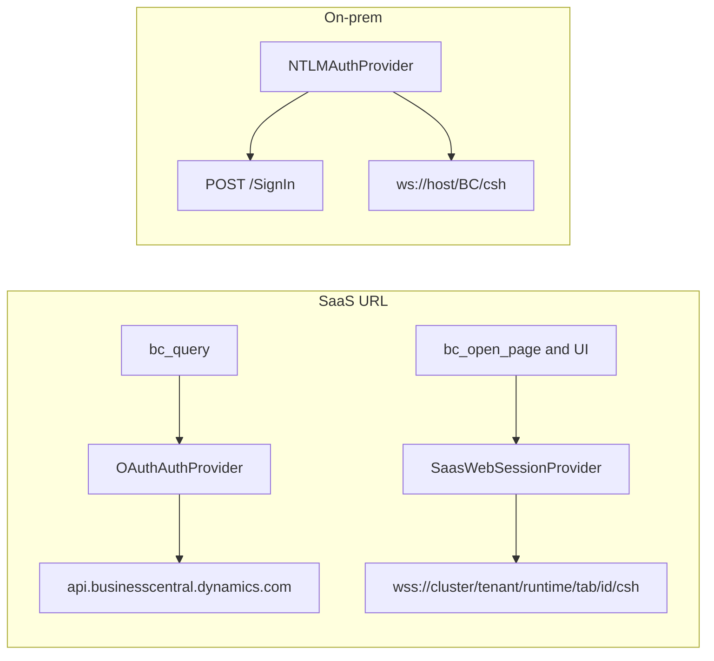
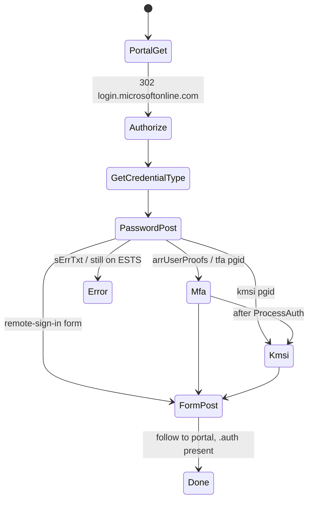
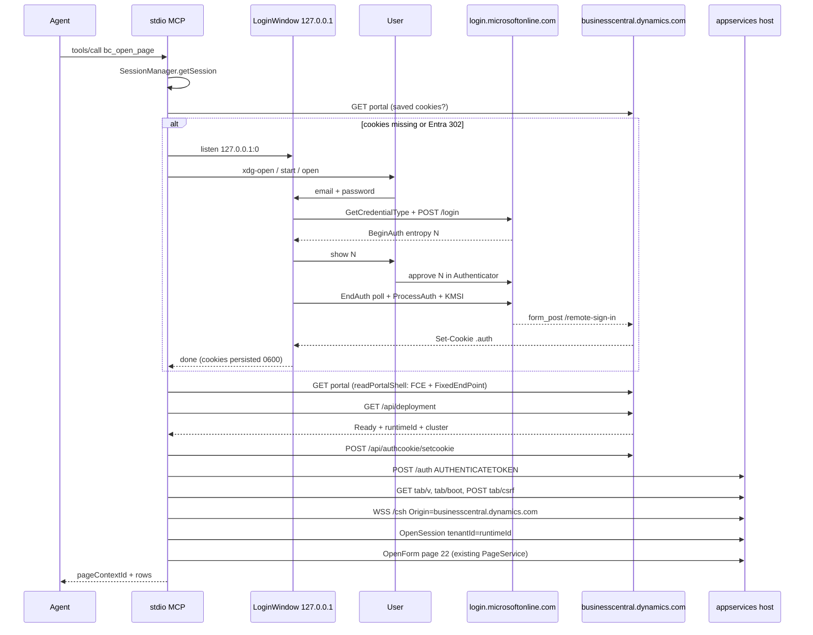
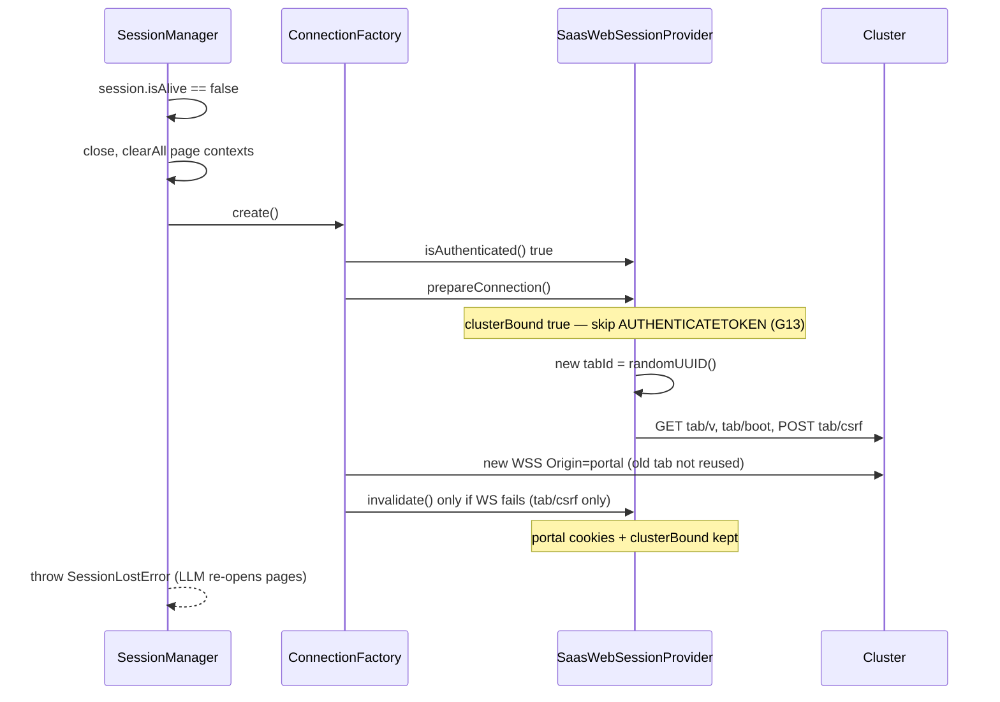

# SaaS web-client session (ESTS) — production design

**Date:** 2026-08-15
**Revised:** 2026-08-15 after two review rounds (error channel, constructor call-site consistency, `requireBearer` always on SaaS, mint-only when `clusterBound`, optional `MCPHandler` opts, `nonRetryable` classifier)
**Author:** (draft for implementation on `feat/saas-web-session`)
**Status:** Draft
**Size:** L
**Branch:** `feat/saas-web-session`
**Prototype archive:** `proto/saas-ests` @ `cc06b05`
**Supersedes (for `/csh` only):** [2026-08-15-oauth-saas-design.md](docs/superpowers/specs/2026-08-15-oauth-saas-design.md) — that spec remains correct for `bc_query` / OData. Its "SaaS `/csh` is blocked" conclusion is closed by the live ESTS gates below.

---

## Overview

`business-central-mcp` can already talk OData to BC Online (`bc_query` via device-code / client-credentials / `BC_ACCESS_TOKEN`). Every other tool (`bc_open_page`, `bc_read_data`, `bc_execute_action`, …) speaks the native `/csh` WebSocket. On SaaS that socket does not live on the Front Door URL the user pastes:

```
https://businesscentral.dynamics.com/7bcb54ae-6d5e-43c7-9402-928aed68ad00/DEV
```

It lives on a per-environment appservices cluster, behind a first-party OpenID Connect cookie session (`996def3d-…` → `form_post` to `/remote-sign-in`). An API Bearer token does not mint that cookie. The 2026-08-15 prototypes proved an HTTP-only ESTS replay — no Chromium, no custom Entra app for `/csh` — plus a loopback sign-in window that never puts the password in env, chat, or tool arguments.

This document is the production plan: re-implement the proven path as proper modules under `connection/ → protocol/ → session/`, with **unit tests first** (mocked `fetch`, no live Entra), then one cookie-gated live smoke against the DEV sandbox. On-prem NavUserPassword (`POST /SignIn`) is unchanged.

---

## Background & Motivation

### Current state

| Surface | Host | Auth today | Tools |
|---|---|---|---|
| Standard API / OData | `api.businesscentral.dynamics.com/v2.0/{aadTenant}/{env}` | Entra Bearer (`OAuthAuthProvider`) | `bc_query` only |
| Web client `/csh` (on-prem) | `{baseUrl}/csh` | `NTLMAuthProvider` (`POST /SignIn`) | all UI tools |
| Web client `/csh` (SaaS) | **not** `{portal}/{env}/csh` | missing | UI tools fail |

`loadConfig()` (`src/core/config.ts`) auto-selects `authMode: 'OAuth'` for any `businesscentral.dynamics.com/{guid}/{env}` URL and **throws at process start** if neither `BC_CLIENT_ID` nor `BC_ACCESS_TOKEN` is set. `createAuthProvider` then returns `OAuthAuthProvider`, whose `bootstrapWebSession` follows a Bearer GET of the portal and correctly gives up when Entra 302s. `ConnectionFactory.buildWebSocketUrl()` still produces `wss://businesscentral.dynamics.com/{tenant}/{env}/csh` and sets `Origin` from `baseUrl`. Unauthenticated (and Bearer-only) `GET {portal}/{env}/csh` is 404 `x-servicefabric: ResourceNotFound`.

`SessionFactory` (`src/session/session-factory.ts`) passes `config.bc.tenantId` — the AAD GUID parsed from the URL — into `BCSession.initialize` → `InteractionEncoder.encodeOpenSession`. SaaS OpenSession requires the **internal runtime id** (`msft1a6720t30818544`), not that GUID.

`stdio-server.ts` treats stdin as JSON-RPC. There is no TTY. A device-code prompt on stderr is acceptable for `bc_query`; it cannot collect a password or an Authenticator number for `/csh`.

### Pain

1. SaaS UI tools are the largest remaining roadmap gap (`ROADMAP.md` Auth).
2. Company policy forbids passwords in env / `claude_desktop_config.json`.
3. MCP form elicitation is forbidden for secrets (MCP spec 2025-11-25).
4. The coding agent starts the MCP; the user is not at a TTY and must not be asked to copy a URL.
5. MFA (Authenticator number matching) is required on the proven tenant.

### What this is not

The prototype scripts (`scripts/proto-saas-*.ts`, `src/connection/auth/ensure-chromium.ts`) are research. They are not imported by production modules. Chromium / Playwright is not a product path.

---

## Goals & Non-Goals

### Goals

- `bc_open_page` (and the rest of the `/csh` stack) works against BC Online sandboxes such as the DEV URL above.
- First-time sign-in opens a **local** window (`127.0.0.1` + `xdg-open` / `open` / `start`, or MCP URL-mode elicitation when the host advertises it). Password and MFA stay in that window.
- Portal cookies persist under `STATE_DIR` mode `0600`. Reconnect and process restart reuse them; they do not force another password.
- Every WebSocket (including SessionManager reconnect) mints a **new tab**.
- `OpenSession.tenantId` is the cluster runtime id.
- `/csh` `Origin` is `https://businesscentral.dynamics.com`, never the cluster host.
- Downloads keep the existing same-origin + same-session rule, against the **tab** HTTPS base.
- `bc_query` keeps working with OAuth and **without** a `/csh` session.
- On-prem NavUserPassword is byte-compatible in behaviour (optional `IBCAuthProvider` methods, NTLM path untouched).
- Full TDD: failing unit tests before each new module. No live Entra in unit tests.

### Non-Goals

- Custom Entra app registration as the `/csh` path (device-code apps stay for `bc_query` only).
- Impersonating first-party `client_id=996def3d-…` as *our* OAuth client.
- Shipping Playwright / `ensure-chromium`.
- Storing the password anywhere (env, `FileTokenCache`, cookie file, logs, tool results).
- OS keychain for cookies (follow-up if policy forbids disk cookies; v1 is `FileTokenCache`-style `0600`).
- Sovereign / GCC clouds (`login.microsoftonline.de`, `.us`, etc.).
- Windows / NTLM (still roadmap).
- ROPC against Entra.
- Changing the invoke queue, FormState, or MCP tool shapes beyond auth errors and download base URL.
- Promoting proto scripts into `src/`.

---

## Evidence (gates already closed)

Treat these as closed. Do not re-open them as implementation questions. Sources: live DEV tenant `7bcb54ae-6d5e-43c7-9402-928aed68ad00` / `DEV` on 2026-08-15, `scripts/proto-saas-ests-login.ts`, `scripts/proto-saas-opensession.ts`, `scripts/proto-saas-login-ui.ts`, and the earlier OAuth probes.

| # | Claim | Result | Source |
|---|---|---|---|
| G1 | Unauthenticated `GET {portal}/{env}/csh` | 404 `x-servicefabric: ResourceNotFound` | proto-saas-csh, oauth spec |
| G2 | API Bearer (device code, client `1950a258`, aud = API or `996def3d`) | does **not** mint `/remote-sign-in` cookies; `/csh` still 404 | proto-saas-api, proto-saas-aud-996def3d, proto-saas-appservices-csh |
| G3 | First-party OIDC | portal 302 → `login.microsoftonline.com/{tid}/oauth2/authorize?client_id=996def3d-b36c-4153-8607-a6fd3c01b89f&redirect_uri=https://businesscentral.dynamics.com/remote-sign-in&response_mode=form_post` | oauth spec, proto-saas-ests-login |
| G4 | ESTS HTTP replay | GET portal → authorize → GetCredentialType → POST `/login` → Authenticator BeginAuth/EndAuth → KMSI → form_post `/remote-sign-in` → `{tenant}.auth` cookie | proto-saas-ests-login `estsPasswordLogin` |
| G5 | Cluster discovery | `GET {portal}/{env}/api/deployment?autoProvision=true` → `status=Ready`, `data=https://{host}.appservices…/?tenant={runtimeId}&tid=…`, `runtimeId=msft1a6720t30818544` | proto-saas-opensession |
| G6 | Shared cookie | `POST {portal}/{env}/api/authcookie/setcookie` body `{subPath:"/tenant/{runtimeId}"}` + `FCE-CSRF-TOKEN` from `#RequestVerificationToken` | proto-saas-opensession |
| G7 | AUTHENTICATETOKEN | **`POST https://{clusterHost}/auth?tenant={runtimeId}&tid=…&deviceCategory=0`** JSON-RPC `["OAUTH", accessToken, false, authorizationCode, homeAccountId, sharedAuthCookieName]`. Tokens from `FixedEndPoint.start({authentication})` in portal HTML. **`POST {tab}/auth` fails** with "Problem detected for the tenant" | proto-saas-opensession (correct); proto-saas-ests-login `authenticateToken` (wrong URL — do not copy) |
| G8 | Origin | `/csh` upgrade **must** send `Origin: https://businesscentral.dynamics.com`. Cluster Origin → HTTP 500 | live + proto-saas-opensession |
| G9 | Tab | Client-generated GUID. Path `https://{cluster}/tenant/{runtimeId}/tab/{tabId}`. New tab per WebSocket. Same tab cannot hold two sockets | proto-saas-opensession `openSession` |
| G10 | Boot | `GET {tab}/v`, `GET {tab}/boot/browser/desktop`, `POST {tab}/csrf` | proto-saas-opensession |
| G11 | OpenSession | Existing `InteractionEncoder.encodeOpenSession` works if `tenantId` is the **runtime id**, not the AAD GUID. Company: `CRONUS USA, Inc.` | proto-saas-opensession |
| G12 | MCP stack | Unchanged `PageService.openPage(22)` → 5 customer rows; `openPage(21)` → 112 fields, 79 with `stringValue`; factbox `LoadForm` hydration ran as on-prem | proto-saas-opensession |
| G13 | Reconnect | New tab + same portal cookies → second OpenSession ok | proto-saas-opensession |
| G14 | Login UX | Loopback HTTP, `xdg-open`, form + MFA number on the page, ESTS, cookies to `.state/proto-ests-cookies.json` | proto-saas-login-ui **PASS** |

`FixedEndPoint.start` lives in portal HTML after `.auth`. `authentication.accessToken` and `authorizationCode` are JWTs used only for AUTHENTICATETOKEN. **Do not log them. Do not persist them.** Re-parse from a cookie-authenticated GET of the portal.

---

## Key Decisions

1. **Two auth surfaces, two providers — not a god provider.** `/csh` on SaaS uses a new `SaasWebSessionProvider`. `bc_query` keeps `OAuthAuthProvider`. Composition root constructs both when a SaaS URL has `BC_CLIENT_ID` / `BC_ACCESS_TOKEN`. Optional methods on `IBCAuthProvider` carry tab/Origin/tenant overrides so `ConnectionFactory` / `SessionFactory` stay provider-agnostic.

2. **`AuthMode` gains `SaasWeb`; OAuth becomes orthogonal.** A SaaS URL no longer means "process cannot start without `BC_CLIENT_ID`". `authMode` describes the `/csh` provider. `bc.oauth` is populated only when API credentials exist, and is required only when `bc_query` runs.

3. **HTTP-only ESTS, acting as the browser.** We complete Microsoft's own `form_post` to Microsoft's `redirect_uri`. We do not register `996def3d` as our app and we do not send that client id except by following the portal's 302.

4. **No password in env, chat, tool args, or MCP form elicitation.** Username may live in config as a prefill. Password exists only in the loopback page POST body and in the in-memory ESTS `/login` POST, then is dropped.

5. **Loopback window is the product UX.** Bind `127.0.0.1` ephemeral port, unguessable `?k=`, auto-open via platform opener. Optional `npx business-central-mcp login` is a human shortcut, never the agent path. If there is no display and the host does not advertise URL-mode elicitation, fail with `SIGN_IN_REQUIRED` — do not print a URL for the user to copy.

6. **`isAuthenticated()` = portal `.auth` is present, not "tab already minted".** `invalidate()` drops **tab / csrf / `PreparedConnection` only**. `clusterBound` survives a generic WS drop (G13). Dead-cluster 401/403/500 calls `markClusterUnbound()` so the next `prepareConnection` re-binds. SessionManager reconnect still calls `prepareConnection()` every time so a new tab is minted.

7. **AUTHENTICATETOKEN URL is the cluster `/auth`, not the tab `/auth`.** Gate G7. The earlier proto helper is wrong; production copies `proto-saas-opensession.ts`. Bind the cluster (deployment + setcookie + AUTHENTICATETOKEN) **once per portal login**; mint a tab on every `create()`.

8. **`Origin` is never derived from the WebSocket host on SaaS.** `getOrigin()` returns `https://businesscentral.dynamics.com`. On-prem keeps `new URL(baseUrl).origin`.

9. **OpenSession `tenantId` is the runtime id** from `/api/deployment` (`msft1…`), via `getSessionTenantId()`. Config `bc.tenantId` stays the AAD GUID for OData/health.

10. **Download `baseUrl` is the tab HTTPS base**, not the portal. Same-session cookie + same-origin rule from [2026-07-24-download-capture-design.md](docs/superpowers/specs/2026-07-24-download-capture-design.md). A portal base would classify cluster `DynamicFileHandler.axd` as external and never fetch; a different session's cookies 404.

11. **Prototype scripts are not production.** Re-implement with injected `fetch`, tests, and redaction. Do not import `scripts/proto-saas-*.ts` or `ensure-chromium.ts`.

12. **Breaking config change is allowed and intentional.** The existing unit test "SaaS URL without `BC_CLIENT_ID` throws" is inverted. On-prem tests are not.

13. **Auth errors propagate unwrapped to the MCP client.** `ConnectionFactory` / `SessionFactory` must not wrap `SignInRequiredError`, `UrlElicitationRequiredError`, or `AuthenticationError` in `ConnectionError`. `SessionManager` must not retry `SIGN_IN_REQUIRED`, `URL_ELICITATION_REQUIRED`, or `AuthenticationError` with `context.nonRetryable === true`. First-create throws the original `BCError` (today a generic `Error`, which `MCPHandler` renders as `Tool error:`). `-32042` is a JSON-RPC `error`, never `result.isError`. Bare NTLM transport `AuthenticationError` stays retryable.

---

## Proposed Design

### Architecture

```
                    ┌─────────────────────────────────────────┐
                    │  MCP tools                               │
                    │  bc_query │ bc_open_page / UI tools      │
                    └──────┬───────────────┬──────────────────┘
                           │               │
                           ▼               ▼
                 OAuthAuthProvider   SaasWebSessionProvider
                 (API Bearer)        (ESTS cookies + tab)
                           │               │
                           ▼               ▼
                     ODataClient     ConnectionFactory
                     api.business…   prepareConnection()
                                     Origin / WS URL / HTTP base
                                           │
                                           ▼
                                     SessionFactory
                                     OpenSession(runtimeId)
                                           │
                                           ▼
                                     PageService … (unchanged)
```

On-prem: a single `NTLMAuthProvider` still serves both OData Basic and `/csh`. Optional methods are unimplemented; factories keep today's defaults.



### Layering (matches existing `connection/ → protocol/ → session/`)

| Layer | New / changed units | Responsibility |
|---|---|---|
| `src/connection/auth/saas/` | cookie jar, HTML extractors, ESTS client, cluster session, cookie store, login window, opener | HTTP-only web session |
| `src/connection/auth/auth-provider.ts` | optional methods | provider contract |
| `src/connection/auth/saas-web-session-provider.ts` | `SaasWebSessionProvider` | implements `IBCAuthProvider` |
| `src/connection/auth/create-auth-provider.ts` | returns `SaasWeb` on SaaS | factory |
| `src/connection/connection-factory.ts` | honor optional methods; always `prepareConnection?()` | WS URL, Origin, HTTP client base |
| `src/session/session-factory.ts` | `getSessionTenantId?()` | OpenSession tenant |
| `src/core/config.ts` | `AuthMode` + no SaaS client-id throw | start-up |
| `src/core/errors.ts` | `SignInRequiredError`, `OAuthNotConfiguredError` | MCP codes |
| `src/server.ts`, `src/stdio-server.ts` | dual provider; CLI `login` dispatch | composition |
| `src/mcp/handler.ts` | optional URL elicitation + `-32042` | host-assisted open |
| protocol / services / operations | **no protocol change** | proven G12 |

---

### Auth split and `AuthMode`

Today (`src/core/config.ts`):

```ts
export type AuthMode = 'NavUserPassword' | 'OAuth';
// SaaS URL + auto → OAuth, and throw if no BC_CLIENT_ID / BC_ACCESS_TOKEN
```

Production:

```ts
export type AuthMode = 'NavUserPassword' | 'OAuth' | 'SaasWeb';
```

`authMode` is **what `ConnectionFactory` uses**. `oauth?: OAuthConfig` is **what `bc_query` uses**. They are independent on SaaS.

| Input | `authMode` | `oauth` | `/csh` provider | `bc_query` |
|---|---|---|---|---|
| On-prem URL, `BC_AUTH` unset | `NavUserPassword` | undefined | `NTLMAuthProvider` | HTTP Basic |
| On-prem + `BC_AUTH=OAuth` + `BC_CLIENT_ID` + `BC_AAD_TENANT_ID` | `OAuth` | populated | `OAuthAuthProvider` (unchanged; AAD on-prem experiment) | Bearer |
| SaaS URL, no client id / token | **`SaasWeb`** | **undefined** | `SaasWebSessionProvider` | `OAUTH_NOT_CONFIGURED` at **execute** time, not at `loadConfig` |
| SaaS URL + `BC_CLIENT_ID` (or `BC_ACCESS_TOKEN`) | **`SaasWeb`** | populated | `SaasWebSessionProvider` | `OAuthAuthProvider` (separate instance) |
| SaaS URL + `BC_AUTH=OAuth` | **`SaasWeb`** | as credentials allow | `SaasWebSessionProvider` | OAuth if configured |
| SaaS URL + `BC_AUTH=NavUserPassword` | `NavUserPassword` | undefined | `NTLMAuthProvider` (will fail SignIn on Front Door; explicit escape hatch) | Basic (useless on SaaS) |

`resolveAuthMode`:

- `saasweb` / `web` / `websession` → `SaasWeb`
- `oauth` / `aad` / `entra` → `OAuth`, **except** when `parseSaasUrl` hits: force `SaasWeb` (OAuth cannot mint `/csh` cookies — G2)
- `navuserpassword` / `userpassword` / `password` → `NavUserPassword`
- `auto` / unset → `SaasWeb` if SaaS URL, else `NavUserPassword`

`resolveAuth` for `SaasWeb`:

- `username` = `BC_USERNAME` or `''` (prefill only; not required)
- `password` = **always `''`**. If `BC_PASSWORD` is set, log a one-line stderr warning that it is ignored (company policy). Do not copy it into `BCConfig`.
- `tenantId` = AAD GUID from URL / `BC_AAD_TENANT_ID` / `BC_TENANT_ID` (config/health/OData identity, **not** OpenSession)
- `oauth` = built only when `BC_CLIENT_ID` or `BC_ACCESS_TOKEN` is set; **no throw** when both are missing
- `appendTenantQuery` = `false`

This **intentionally breaks** `tests/unit/config.test.ts` case `"throws when a SaaS URL is used without BC_CLIENT_ID or BC_ACCESS_TOKEN"`. Rewrite that test. Leave the on-prem missing-password tests alone.

#### `createAuthProvider` signature (DI, no implicit NTLM)

`createAuthProvider(config, logger)` is the only production factory (`server.ts:49`, `stdio-server.ts:49`). It must not fall through `SaasWeb` to `NTLMAuthProvider` (that would `POST {portal}/SignIn` with `password === ''`). Exhaustive switch:

```ts
export interface SaasWebDeps {
  opener: BrowserOpener;
  /** PR 5 default: load cookie store or SignInRequiredError.
   *  PR 6: () => loginWindow.run() (may return UrlElicitationRequiredError). */
  ensurePortalSession: () => Promise<Result<void, SignInRequiredError | AuthenticationError | UrlElicitationRequiredError>>;
  fetchFn?: typeof fetch;
  /** Mutable port. MCPHandler.handleInitialize writes client elicitation.url here.
   *  authenticate() runs on first tools/call, after initialize. */
  elicitation?: ClientElicitationPort;
  loginTimeoutMs?: number;
}

export function createAuthProvider(
  config: AppConfig,
  logger: Logger,
  saasDeps?: SaasWebDeps,
): IBCAuthProvider {
  switch (config.bc.authMode) {
    case 'OAuth':
      // existing OAuthAuthProvider construction
    case 'SaasWeb':
      if (!saasDeps) {
        throw new Error(
          'authMode is SaasWeb but createAuthProvider was called without SaasWebDeps. '
          + 'Pass opener + ensurePortalSession (see stdio-server / server composition).',
        );
      }
      return new SaasWebSessionProvider({ ...fromConfig(config), ...saasDeps, logger });
    case 'NavUserPassword':
      return new NTLMAuthProvider({ ... });
  }
}
```

PR 4 lands `AuthMode` + this switch **before** `SaasWebSessionProvider` exists: the `SaasWeb` arm throws the same complete error (not a TODO body, not `else NTLM`). Test: `authMode: 'SaasWeb'` without deps → throw mentioning `SaasWebDeps`. PR 5 replaces the throw with `new SaasWebSessionProvider`.

#### Composition root (`src/server.ts`, `src/stdio-server.ts`)

```ts
const elicitationPort = new ClientElicitationPort(); // { url: boolean }, filled at initialize
const loginWindow = new LoginWindow({ /* opener, timeout, usernamePrefill; PR 6 */ });

const uiAuth = createAuthProvider(config, logger, config.bc.authMode === 'SaasWeb'
  ? {
      opener: new PlatformBrowserOpener(),
      ensurePortalSession: () => loginWindow.run(), // PR 5: cookie-only stub-free callback
      elicitation: elicitationPort,
      loginTimeoutMs: 5 * 60_000,
    }
  : undefined);

const apiAuth = config.bc.oauth
  ? new OAuthAuthProvider({
      baseUrl: config.bc.baseUrl,
      aadTenantId: config.bc.oauth.aadTenantId,
      clientId: config.bc.oauth.clientId,
      clientSecret: config.bc.oauth.clientSecret,
      scope: config.bc.oauth.scope,
      accessToken: config.bc.oauth.accessToken,
      stateDir: config.stateDir, // same FileTokenCache path as today
    }, logger)
  : uiAuth;

const connectionFactory = new ConnectionFactory(uiAuth, config.bc, logger);
const queryOperation = createQueryOperation(config, apiAuth);
const sessionFactory = new SessionFactory(
  connectionFactory, decoder, encoder, logger,
  config.bc.tenantId, config.bc.invokeTimeoutMs, config.bc.profile,
  () => uiAuth.getSessionTenantId?.() ?? config.bc.tenantId,
);
const mcpHandler = new MCPHandler(lazyTools, logger, PROMPTS, { elicitationPort });
```

`MCPHandler` constructor is ` (tools, logger, prompts = [], opts?: { elicitationPort?: ClientElicitationPort }) `. The 4th argument is optional so the existing ~40 unit tests that call it with 2–3 args stay green (`handler.ts:48-52`). PR 6 adds the optional bag; it does not change positional arity.

Chicken-and-egg: `MCPHandler` is constructed after `uiAuth` today. `ClientElicitationPort` is a small mutable object both hold. `initialize` runs before any `tools/call`, so `authenticate()` sees the advertised `elicitation.url` flag.

PR 5 (no window yet): `ensurePortalSession` = load `FileCookieStore` or `err(new SignInRequiredError('A display is required to sign in to Business Central Online.', { openedWindow: false, reason: 'no_display' }))`. That is a finished function, not a stub provider. All production and test constructions use this two-arg form (see Errors and MCP surface).

#### `bc_query` guard (`requireBearer`, not `environmentName`)

`QueryOperation` today only has `ODataClientConfig` (`query.ts:48-55`) — no `environmentName`, no `authMode`. `BC_ENVIRONMENT` can set `environmentName` on-prem (`config.ts:176`), so that field is not a SaaS predicate. `ODataClient.resolveAuthorization` (`odata-client.ts:93-101`) falls through to Basic **whenever `username` is non-empty**. SaaS `BC_USERNAME` is an email prefill and `password` is `''` — without a dedicated flag, `bc_query` would send `Basic <email>:` to `api.businesscentral.dynamics.com`.

Do **not** put SaaS policy on `ODataClient`. Extend `QueryOperation` only:

```ts
export class QueryOperation {
  private readonly requireBearer: boolean;
  private readonly getAuthorization: ODataClientConfig['getAuthorization'];

  constructor(config: ODataClientConfig, opts: { requireBearer?: boolean } = {}) {
    this.requireBearer = opts.requireBearer ?? false;
    this.getAuthorization = config.getAuthorization;
    this.client = new ODataClient(config);
    this.defaultTop = config.defaultTop ?? 100;
  }

  async execute(input: QueryInput): Promise<Result<QueryOutput, ProtocolError | OAuthNotConfiguredError>> {
    if (this.requireBearer) {
      const header = this.getAuthorization ? await this.getAuthorization() : undefined;
      if (!header) {
        return err(new OAuthNotConfiguredError(
          'bc_query on BC Online requires an Entra app. Set BC_CLIENT_ID (device code), '
          + 'BC_CLIENT_SECRET (S2S), or BC_ACCESS_TOKEN.',
        ));
      }
    }
    // existing client.query
  }
}

export function createQueryOperation(config: AppConfig, authProvider: IBCAuthProvider): QueryOperation {
  return new QueryOperation({
    odataUrl: config.bc.odataUrl,
    tenantId: config.bc.tenantId,
    username: config.bc.username,
    password: config.bc.password,
    defaultCompanyName: config.bc.odataCompanyName,
    appendTenantQuery: config.bc.appendTenantQuery,
    getAuthorization: async () => {
      if (typeof authProvider.getAccessToken !== 'function') return undefined;
      const token = await authProvider.getAccessToken();
      return token ? `Bearer ${token}` : undefined;
    },
  }, {
    requireBearer: config.bc.authMode === 'SaasWeb',
  });
}
```

`requireBearer` is **unconditional on SaaS** (`authMode === 'SaasWeb'`), including when `config.bc.oauth` is populated. Complementary bug: `createQueryOperation` still passes `username: config.bc.username` (email prefill) and `password: ''` into `ODataClient`. If `requireBearer` were false and `getAccessToken()` returned `undefined` (refresh failed, device-code not finished — `oauth-provider.ts` logs a warn and returns `undefined`), `ODataClient.resolveAuthorization` (`odata-client.ts:93-101`) would send `Basic <prefill>:` to `api.businesscentral.dynamics.com`. SaaS never accepts NavUserPassword Basic.

If `requireBearer` and `getAuthorization()` is missing/undefined, return `OAUTH_NOT_CONFIGURED` **before** `client.query` (zero `fetch`). Do not open the login window. `bc_query` continues to bypass `ensureSession()` (`stdio-server.ts:127-129`, `server.ts:124-126`). On-prem (`requireBearer: false`) is unchanged.

Unit tests (`tests/unit/odata-query-operation.test.ts`):

1. `requireBearer: true`, `username: 'user@t.com'`, `password: ''`, no `getAuthorization` → `OAUTH_NOT_CONFIGURED`, zero `fetch`.
2. `requireBearer: true`, oauth-shaped `getAuthorization` returning `undefined`, `username: 'user@t.com'` → same, **no Basic**.
3. `requireBearer: false` (on-prem) + username/password still uses Basic (existing).

---

### `IBCAuthProvider` extensions

`src/connection/auth/auth-provider.ts` — additive, all optional, so `NTLMAuthProvider` and `OAuthAuthProvider` compile unchanged:

```ts
export interface PreparedConnection {
  tabId: string;
  tabBaseUrl: string;     // https://{cluster}/tenant/{runtime}/tab/{tab}
  clusterHost: string;
  runtimeId: string;
  csrfToken: string;
}

export type AuthFailure =
  | AuthenticationError
  | SignInRequiredError
  | UrlElicitationRequiredError
  | ConnectionError;

export interface IBCAuthProvider {
  /** Result only — never throw SignInRequired / UrlElicitation (those are Err values). */
  authenticate(): Promise<Result<AuthResult, AuthFailure>>;
  getWebSocketHeaders(): Record<string, string>;
  getWebSocketQueryParams(): Record<string, string>;
  isAuthenticated(): boolean;
  invalidate(): void;
  getAccessToken?(): Promise<string | undefined>;

  /** Bind cluster if needed, then mint a NEW tab + csrf. Called on every
   *  ConnectionFactory.create(), including SessionManager reconnect. */
  prepareConnection?(): Promise<Result<PreparedConnection, AuthFailure>>;

  /** Absolute WS URL without query (factory still appends ackseqnb + csrf). */
  getWebSocketUrl?(): string | undefined;

  /** WebSocket Origin. SaaS: https://businesscentral.dynamics.com */
  getOrigin?(): string | undefined;

  /** HTTPS base for BCHttpClient + collectDownloads (tab base on SaaS). */
  getHttpBaseUrl?(): string | undefined;

  /** OpenSession tenantId (runtime id on SaaS). */
  getSessionTenantId?(): string | undefined;

  /** Cluster session is dead (401/403/500 on mint/csrf/WS). Next prepare re-binds. */
  markClusterUnbound?(): void;
}
```

Semantics (SaaS):

| Method | Meaning |
|---|---|
| `isAuthenticated()` | Portal session valid: we have a `{aadTenant}.auth` (or `.AspNetCore.Cookies`) cookie that last probed as not-an-Entra-302. **Not** "tab minted". |
| `authenticate()` | Ensure portal session. Load disk cookies → GET portal. If 200 and not Entra, success. Else `ensurePortalSession()` (window / elicitation). Returns `Result` (`SignInRequiredError` / `UrlElicitationRequiredError` as `err`, never thrown). Single-flight (`inflight`, same `finally` clear as `OAuthAuthProvider.authenticate` at `oauth-provider.ts:59-66`). A second caller joins the same promise; `LoginWindow` is a process singleton (one `listen(0)`, one `k`). |
| `prepareConnection()` | Requires `isAuthenticated()`. If `clusterBound`: **only** `mintTab()` (G13 — no portal GET, no AUTHENTICATETOKEN). If `!clusterBound`: `readPortalShell` → discover → setcookie → AUTHENTICATETOKEN, then `clusterBound=true`, then `mintTab()`. Portal 302 during bind → `authenticated=false`, `clusterBound=false`, `AuthenticationError`; factory may `authenticate()` **once** and prepare again. |
| `invalidate()` | Drop **tab / csrf / `PreparedConnection` only**. Keep portal cookies and `authenticated=true`. **Do not** clear `clusterBound` here — a failed WS is often just a dead tab (G13). |
| `markClusterUnbound?()` | Set `clusterBound=false`. Called when `mintTab` / `/csrf` / `ws.connect` looks like a **dead cluster session** (HTTP 401/403/500, or AUTHENTICATETOKEN-style tenant errors). SessionManager then retries `create()`; the next `prepareConnection` re-binds (portal GET + AUTH) instead of minting onto a corpse. |
| `getWebSocketHeaders()` | `Cookie` for the cluster host, plus SaaS `User-Agent` (Chrome desktop constant) and `Referer: {portalUrl}`. Never `Authorization: Bearer`. Never `Origin` (factory sets Origin; `BCHttpClient` reuses this map — CLAUDE.md). |
| `getWebSocketQueryParams()` | `{ csrftoken }` from `POST /csrf` (or AUTHENTICATETOKEN result as fallback). |
| `getOrigin()` | `saas.origin` from `parseSaasUrl` = `https://businesscentral.dynamics.com` |
| `getWebSocketUrl()` | `wss://{cluster}/tenant/{runtime}/tab/{tab}/csh` after prepare; `undefined` before |
| `getHttpBaseUrl()` | `https://{cluster}/tenant/{runtime}/tab/{tab}` after prepare |
| `getSessionTenantId()` | `runtimeId` after prepare |

`NTLMAuthProvider.invalidate()` still clears everything (on-prem SignIn is cheap and there is no "portal vs tab" split).

---

### Error channel (end-to-end)

Today the designed UX cannot reach the client:

| Layer | Today | Problem |
|---|---|---|
| `ConnectionFactory.create()` | wraps every auth failure as `ConnectionError(\`Authentication failed: …\`)` (`connection-factory.ts:17-21`) | `SIGN_IN_REQUIRED` / `-32042` become `CONNECTION_ERROR` |
| `SessionFactory.create()` | `Result<BCSession, ConnectionError>` only (`session-factory.ts:20`) | type cannot carry `SignInRequiredError` |
| `SessionManager.createWithBackoff()` | retries **every** `err`; only special-case is `LogicalModalityViolation` substring (`session-manager.ts:154-172`) | no-display / cancelled login retried 5 times |
| First-create exhaustion | `throw new Error('Session creation failed after all retry attempts')` (`session-manager.ts:131-132`) | not a `BCError` |
| `MCPHandler.handleToolsCall` | `BCError` → `result.isError` + `formatBcError`; anything else → `Tool error:` (`handler.ts:205-230`) | generic `Error` loses the hint; `-32042` must be JSON-RPC `error`, not `result` |

Widen the factory Result (still a `Result`, still no throw inside `create()`):

```ts
export type SessionCreateError =
  | ConnectionError
  | AuthenticationError
  | SignInRequiredError
  | UrlElicitationRequiredError;

// ConnectionFactory.create(): Promise<Result<BCWebSocket, SessionCreateError>>
// SessionFactory.create():    Promise<Result<BCSession, SessionCreateError>>
```

Pass-through rule: if `authenticate()` / `prepareConnection()` returns `err(e)` and `e` is already a `BCError` listed above, **return `err(e)` unwrapped**. Wrap only unexpected failures (`TypeError`, network `Error`) as `ConnectionError`.

`src/session/session-create-error.ts` (pure, next to `rpc-error-classifier.ts`):

```ts
export function isNonRetryableSessionCreateError(error: {
  code?: string;
  context?: Record<string, unknown>;
}): boolean {
  if (error.code === 'SIGN_IN_REQUIRED' || error.code === 'URL_ELICITATION_REQUIRED') return true;
  // ESTS / credential rejection only. Do NOT treat every AUTHENTICATION_ERROR
  // as fatal: NTLMAuthProvider's catch wraps GET/POST /SignIn transport
  // failures as AuthenticationError (ntlm-provider.ts:132-136) and those
  // must stay retryable (today they are ConnectionError and SessionManager
  // backs off). Callers set context.nonRetryable on user-facing rejects.
  return error.code === 'AUTHENTICATION_ERROR' && error.context?.nonRetryable === true;
}
```

Do **not** retry interactive login (`SIGN_IN_REQUIRED`, elicitation) or a rejected password (`nonRetryable: true`). Retry `prepareConnection` / WS / OpenSession / NTLM transport blips / `LogicalModalityViolation`.

Who sets `context.nonRetryable: true`:

- ESTS `sErrTxt`, still-on-login, missing `waitForOtp` → `new AuthenticationError(msg, { nonRetryable: true })`
- NTLM login page re-render (wrong password) → same flag (small on-prem improvement in PR 4; today this is retried as `ConnectionError`)
- NTLM `catch` around `fetch` → **no** flag (retry)

This is an intentional, documented on-prem change only for the wrong-password path. Transport failures stay retryable. Do not write “on-prem path identical” without this sentence.

`SessionManager.createWithBackoff()`:

```
result = sessionFactory.create()
if ok → return session
if isNonRetryableSessionCreateError(result.error) → throw result.error   // original BCError
else → existing backoff (LogicalModalityViolation substring stays)
```

First-create exhaustion: `throw lastError` if it is a `BCError`, else `new ConnectionError('Session creation failed after all retry attempts')`. Do **not** throw a bare `Error`. Reconnect path: a non-retryable auth error is thrown as-is (the LLM must see `SIGN_IN_REQUIRED`, not `SESSION_LOST`). Transient reconnect exhaustion stays `SessionLostError({ reconnectFailed: true })`.

`MCPHandler.handleToolsCall` (after the existing `SessionLostError` branch):

```ts
if (e instanceof UrlElicitationRequiredError) {
  return {
    jsonrpc: '2.0',
    id: request.id,
    error: {
      code: -32042,
      message: e.message,
      data: { elicitations: e.elicitations },
    },
  };
}
if (e instanceof BCError) {
  return { jsonrpc: '2.0', id: request.id, result: { content: [{ type: 'text', text: formatBcError(e) }], isError: true } };
}
```

`-32042` is returned from `handleToolsCall`, not thrown out to `handleRequest`'s `-32603` catch. Form-mode elicitation is never sent.

Default reconnect is 4 retries at 1s/2s/4s/8s (`BC_RECONNECT_MAX_RETRIES`). Combined with a 5-minute `loginTimeoutMs`, retrying `SignInRequiredError` would block ~25 minutes and bind a new loopback server each time. The classifier makes that impossible.

Mid-prepare portal 302: `ConnectionFactory.create()` may call `authenticate()` **once** and `prepareConnection()` once more. If that authenticate is `SIGN_IN_REQUIRED` / elicitation / ESTS failure, return it unwrapped (no third try, no SessionManager retry).

---

### `ConnectionFactory` changes

`src/connection/connection-factory.ts` today wraps auth failures and sets `Origin` from `baseUrl`.

Production `create()`:

```ts
async create(): Promise<Result<BCWebSocket, SessionCreateError>> {
  if (!this.authProvider.isAuthenticated()) {
    const authResult = await this.authProvider.authenticate();
    if (isErr(authResult)) return err(authResult.error); // unwrapped
  }

  if (this.authProvider.prepareConnection) {
    let prepared = await this.authProvider.prepareConnection();
    if (isErr(prepared) && prepared.error.code === 'AUTHENTICATION_ERROR') {
      // Portal 302 during prepare: one re-login, then one more prepare.
      const again = await this.authProvider.authenticate();
      if (isErr(again)) return err(again.error);
      prepared = await this.authProvider.prepareConnection();
    }
    if (isErr(prepared)) return err(prepared.error); // unwrapped, including SIGN_IN_REQUIRED
  }

  const headers = { ...this.authProvider.getWebSocketHeaders() };
  headers['Origin'] = this.authProvider.getOrigin?.() ?? new URL(this.bcConfig.baseUrl).origin;

  const wsUrl = this.buildWebSocketUrl();
  const connectResult = await ws.connect({ url: wsUrl, headers, timeoutMs: this.bcConfig.timeoutMs });
  if (isErr(connectResult)) {
    this.authProvider.invalidate(); // tab-only on SaaS
    if (isDeadClusterConnect(connectResult.error)) {
      this.authProvider.markClusterUnbound?.();
    }
    return connectResult;
  }
  return ok(ws);
}

// 401/403/500 on the upgrade, or "Problem detected for the tenant"
function isDeadClusterConnect(error: ConnectionError): boolean {
  return /HTTP 401|HTTP 403|HTTP 500|Problem detected for the tenant/i.test(error.message);
}
```

`buildWebSocketUrl()`:

```ts
const path = this.authProvider.getWebSocketUrl?.()
  ?? `${this.bcConfig.baseUrl.replace(/^http/, 'ws')}/csh`;
const queryParams = { ...this.authProvider.getWebSocketQueryParams(), ackseqnb: '-1' };
// same empty-value filter as today
```

On-prem: no `getWebSocketUrl` / `getOrigin` / `prepareConnection` → behaviour identical to today, including the BC 28.3 Origin rule (`docs/investigations/2026-07-24-bc283-csh-403.md`).

Failed `ws.connect` still calls `invalidate()`. On SaaS that drops the tab only; the next backoff iteration authenticates as a no-op (cookies still good) and `prepareConnection` mints another tab. That is the G13 reconnect path.

`createHttpClient()`:

```ts
return new BCHttpClient(
  this.authProvider.getHttpBaseUrl?.() ?? this.bcConfig.baseUrl,
  () => this.authProvider.getWebSocketHeaders(),
  this.logger,
);
```

`buildServices` in both servers must pass the same base into `DownloadService` for `collectDownloads` same-origin:

```ts
const httpClient = connectionFactory.createHttpClient();
const downloadBase = authProvider.getHttpBaseUrl?.() ?? config.bc.baseUrl;
const downloadService = new DownloadService(httpClient, downloadBase, config.bc.downloadLimits, logger);
```

`createHttpClient` is only called from `buildServices` **after** `getSession()` (i.e. after `prepareConnection`). On reconnect, `needsServiceRebuild` rebuilds services against the new tab. Do not construct `DownloadService` before the first `create()`.

---

### `SessionFactory` tenant override

```ts
constructor(
  /* existing args */,
  private readonly resolveTenantId: () => string = () => this.tenantId,
) {}

async create(): Promise<Result<BCSession, SessionCreateError>> {
  const wsResult = await this.connectionFactory.create();
  if (isErr(wsResult)) return wsResult; // already SessionCreateError
  const tenantId = this.resolveTenantId();
  const session = new BCSession(wsResult.value, this.decoder, this.encoder, this.logger,
    tenantId, this.timeoutMs, this.profile);
  const initResult = await session.initialize(tenantId);
  // existing close-on-err still wraps initialize failures as ConnectionError
}
```

`encodeOpenSession` is unchanged. It already puts `tenantId` in both the RPC field and `query: tenant=${tenantId}&runinframe=1` (`src/protocol/interaction-encoder.ts:90-125`). Passing the runtime id is sufficient (G11).

Do **not** change `config.bc.tenantId` to the runtime id. Health, logs, and OData path derivation stay on the AAD GUID.

---

### Module breakdown (new code, all fully implemented)

Do not dump this into `oauth-provider.ts`. New directory:

```
src/connection/auth/saas/
  cookie-jar.ts              // RFC-lite jar: name, value, domain, path, secure, expires
  cookie-store.ts            // FileCookieStore, mode 0600, keyed by aadTenant+env
  html-extract.ts            // $Config, FixedEndPoint.start, form_post, inputs, FCE token
  ests-types.ts              // EstsStatus, SasJson, DeploymentReady, FixedEndPointAuth
  ests-login.ts              // EstsLoginClient state machine
  cluster-session.ts         // readPortalShell, bindCluster, mintTab
  browser-opener.ts          // BrowserOpener + PlatformBrowserOpener
  login-page.ts              // HTML string (password field, MFA entropy)
  login-window.ts            // 127.0.0.1 ephemeral HTTP
  redact.ts                  // redactLog(msg, context) — strings AND Logger context
  session-create-error.ts    // lives in src/session/ (classifier)
saas-web-session-provider.ts // implements IBCAuthProvider (sits next to ntlm/oauth)
```

`src/cli/login.ts` — optional TTY/window command.

Existing `mergeSetCookies` / `extractCsrf` in `oauth-provider.ts` stay for the OAuth bootstrap path. The SaaS jar is domain-aware; do not reuse the flat merger as the production jar.

#### Cookie jar (`cookie-jar.ts`)

The prototype `Map<name,value>` worked because names did not collide. Production must not send ESTS cookies to the cluster or persist ESTS login cookies.

```ts
export interface CookieRecord {
  name: string;
  value: string;
  domain: string;
  path: string;
  secure: boolean;
  expires?: number; // epoch ms; omit = session
}

export class CookieJar {
  absorb(res: Response, requestUrl: string): void;
  headerFor(url: string): string;          // RFC 6265 domain/path/secure filter
  names(): string[];
  hasPortalAuth(aadTenantId: string): boolean; // `{tid}.auth` or `.AspNetCore.Cookies`
  persistable(): CookieRecord[];           // portal host only
  load(records: CookieRecord[]): void;
}
```

`headerFor('https://login.microsoftonline.com/…')` vs `headerFor('https://businesscentral.dynamics.com/…')` vs `headerFor('https://{cluster}/…')` are different. Default-domain when `Set-Cookie` omits `Domain` is the request host.

#### Cookie store (`cookie-store.ts`)

Mirror `FileTokenCache` (`src/connection/auth/token-cache.ts`):

- Path: `{STATE_DIR}/saas-web-cookies.json`
- `writeFileSync(..., { mode: 0o600 })` + `chmod 0600`
- Payload: `{ v: 1, aadTenantId, environmentName, savedAt, cookies: CookieRecord[] }`
- `load(aadTenantId, environmentName)` returns `undefined` on mismatch (do not reuse DEV cookies on production)
- **Never** write password, `passwd`, JWTs, `flowToken`, `canary`, `PPFT`
- Persist only cookies whose domain is `businesscentral.dynamics.com` or a subdomain (portal `.auth`, antiforgery, `ASLBSA`, correlation leftovers). Cluster cookies are reminted by setcookie + AUTHENTICATETOKEN. ESTS cookies are not persisted.

If a later policy forbids disk cookies, replace this class with an OS-keychain store. Same interface. Not v1.

#### HTML extractors (`html-extract.ts`)

Pure functions, table-driven tests, no I/O. Lifted from the proto but with balanced-brace parse kept (portal HTML is not reliable Cheerio-friendly for `$Config=` / `FixedEndPoint.start(`).

```ts
export function parseBalancedObject(src: string, from: number): Record<string, unknown> | undefined;
export function parseConfig(html: string): Record<string, unknown> | undefined;          // `$Config=`
export function parseFixedEndPoint(html: string): Record<string, unknown> | undefined; // `FixedEndPoint.start(`
export function extractInputs(html: string): Record<string, string>;
export function extractForm(html: string): { action: string; fields: Record<string, string> } | undefined;
export function isRemoteSignIn(form: { action: string; fields: Record<string, string> }): boolean;
export function extractFceToken(html: string): string; // #RequestVerificationToken
export function pageInfo(html: string): { pgid: string; hpgid: string; err: string; proofs: string[] };
export function parseDeploymentJson(text: string): { status: string; clusterAddress: string; runtimeId: string; tid: string } | undefined;
export function extractFixedEndPointAuth(fp: Record<string, unknown>): {
  accessToken: string; authorizationCode: string; homeAccountId: string; sharedAuthCookieName: string;
};
```

`parseDeploymentJson` accepts the live shapes: `data` as URL string **or** `{ clusterAddress }`, `runtimeId` on the object **or** `?tenant=` on the URL, `tid` from the URL query.

#### ESTS login (`ests-login.ts`)

```ts
export type EstsStatus = {
  phase: 'signing-in' | 'mfa' | 'finishing' | 'done' | 'error';
  entropy?: string;
  message?: string;
};

export class EstsLoginClient {
  constructor(
    private readonly fetchFn: typeof fetch,
    private readonly jar: CookieJar,
    private readonly logger: Logger,
    private readonly onStatus: (s: EstsStatus) => void,
    private readonly sleep: (ms: number) => Promise<void>,
  ) {}

  async login(opts: {
    username: string;
    password: string;
    portalUrl: string;
    /** Resolved by LoginWindow POST /mfa-code. Required when ESTS offers PhoneAppOTP / SMS. */
    waitForOtp?: () => Promise<string>;
  }): Promise<Result<void, AuthenticationError>>
}
```

State machine (G4). Each step is a named private method so tests can drive one transition:



Rules:

- `User-Agent` is a desktop Chrome string (Entra fingerprints non-browser UAs). Constant in `ests-types.ts`.
- Password goes **only** in the `passwd` field of the ESTS `/login` body. After `login()` returns, the caller must drop its copy. The client must not assign `password` onto `this`.
- MFA preference: `PhoneAppNotification` if listed, else `PhoneAppOTP`, else first proof (same as proto).
- Number matching: `BeginAuth` → log + `onStatus({ phase:'mfa', entropy })` → poll `EndAuth` every 2s for 90s. Entropy **may** appear in stderr (the user needs it); it is not a secret.
- TOTP / SMS (v1, local page only): when preferred method is `PhoneAppOTP` (or no entropy after BeginAuth), call `onStatus({ phase: 'mfa', message: 'Enter the code from Authenticator' })` then `const code = await waitForOtp()`. If `waitForOtp` is missing, return `AuthenticationError('TOTP required but no waitForOtp was provided')`. `waitForOtp` times out at 90s (same as push). After the SAS `EndAuth` POST, overwrite the local `code` binding. **Never** read `process.env.BC_MFA_CODE` (proto-only). Never MCP form elicitation or tool args. `LoginWindow` implements `waitForOtp` via an `OtpGate`: `POST /mfa-code` calls `gate.provide(code)`; ESTS awaits `gate.wait()`.
- KMSI: auto-POST `LoginOptions=1` (Keep me signed in) so the `.auth` cookie lasts across process restarts.
- Follow redirects with `redirect: 'manual'` and the jar. Cap hops (8–10).
- `sErrTxt` → `AuthenticationError` with the Entra text (no password in the message).
- Logger is a wrapping `redactingLogger(inner)` that runs `redactLog(msg, context)` on **both** the message string and the optional `context` object (`Logger.info(msg, context?)` is `JSON.stringify`d with `...context` in `logger.ts:33-36`; `LOG_REDACT_VALUES` exists on `LoggingConfig` but is unused). Redact `passwd`, `password`, `cookie`, `flowToken`, `canary`, `PPFT`, `sFT`, `accessToken`, `authorizationCode`, `code=`, `eyJ` JWT prefix. Tests pass a context `{ password: 's3cretPASS', accessToken: 'eyJfixture' }` and assert neither argument that reaches the inner logger contains those strings.

Do not construct `client_id=996def3d`. Follow the portal `Location`.

#### Cluster session (`cluster-session.ts`)

```ts
export class SaasClusterSession {
  constructor(private readonly fetchFn: typeof fetch, private readonly logger: Logger) {}

  /** GET {portalUrl} with jar + Chrome UA + portal Origin. Parse FCE + FixedEndPoint. */
  async readPortalShell(jar: CookieJar, saas: SaasTarget): Promise<Result<{
    fceToken: string;
    auth: FixedEndPointAuth;
    html: string;
  }, ConnectionError | AuthenticationError>>;

  async discover(jar: CookieJar, saas: SaasTarget): Promise<Result<DeploymentReady, ConnectionError>>;
  async shareAuthCookie(jar: CookieJar, saas: SaasTarget, runtimeId: string, fceToken: string): Promise<Result<void, ConnectionError>>;
  async authenticateToken(
    jar: CookieJar,
    clusterHost: string,
    runtimeId: string,
    tid: string,
    auth: FixedEndPointAuth,
  ): Promise<Result<string /* csrf */, ConnectionError>>;
  async mintTab(
    jar: CookieJar,
    clusterHost: string,
    runtimeId: string,
    portalOrigin: string,
    csrfHint: string,
  ): Promise<Result<PreparedConnection, ConnectionError>>;
}
```

Exact URLs (G5–G10). Every cluster `fetch` sends Chrome desktop `User-Agent`, `Origin: https://businesscentral.dynamics.com`, `Referer: {portalUrl}` (proto `openSession` lines 342–371).

0. **`GET {portalUrl}`** (`readPortalShell`) — **only when `clusterBound === false`**. Cookie jar, Chrome UA, portal Origin. Parse `#RequestVerificationToken` (`fceToken`) and `FixedEndPoint.start({authentication})`. If `accessToken` is missing, **fail the bind** with `ConnectionError('FixedEndPoint.start has no accessToken; portal shell is not a signed-in session')`. Do not skip AUTHENTICATETOKEN the way the proto logged-and-continued. Log only `hasAccess`/`hasCode` booleans; unit-test that the logger never contains the fixture JWT. When `clusterBound === true`, skip this GET entirely (G13).
1. `GET {portalUrl}/api/deployment?redirectedFromSignup=false&autoProvision=true`  
   Headers: `Accept: application/json`, `X-Requested-With: XMLHttpRequest`, `Origin: {portalOrigin}`.
2. `POST {portalUrl}/api/authcookie/setcookie`  
   Body: `{"subPath":"/tenant/{runtimeId}"}`. Header `FCE-CSRF-TOKEN` from `#RequestVerificationToken` on the portal HTML.
3. `POST https://{clusterHost}/auth?tenant={runtimeId}&tid={tid}&deviceCategory=0`  
   JSON-RPC:
   ```json
   {
     "jsonrpc": "2.0",
     "method": "AUTHENTICATETOKEN",
     "params": ["OAUTH", "<accessToken>", false, "<authorizationCode>", "<homeAccountId>", "<sharedAuthCookieName>"],
     "id": "|{uuid32}.{16hex}"
   }
   ```
   `Origin: https://businesscentral.dynamics.com`. **Not** `{tabBase}/auth`.
4. `tabId = randomUUID()` — every call.
5. `GET {tabBase}/v`, `GET {tabBase}/boot/browser/desktop`, `POST {tabBase}/csrf` with portal Origin.
6. CSRF: JSON `csrfToken` if present, else antiforgery cookie.

Log `hasAccess=true/false`, `hasCode=true/false`, HTTP statuses, `runtimeId`, `clusterHost`, `tabId`. Never log token strings.

If AUTHENTICATETOKEN RPC-errors **during the initial bind** (no cluster cookies yet), fail `prepareConnection`. The proto's silent `return ''` is not production quality.

**Bind once, mint every time (G13):**

| Step | When |
|---|---|
| `readPortalShell` + `discover` + `shareAuthCookie` + `authenticateToken` | **Only** when `clusterBound === false` (first prepare after portal login, after `authenticate()` success, or after `markClusterUnbound()`) |
| `mintTab` | **Every** `prepareConnection` — new `randomUUID()` |

When `clusterBound === true`, `prepareConnection` is **only** `mintTab` (boot + `/csrf`). No portal GET, no AUTHENTICATETOKEN. That is G13 (`proto-saas-opensession.ts:317-394`): reconnect reminted a tab without another portal GET or AUTH.

If `mintTab` / `/csrf` returns 401/403/500 (or AUTH-style “Problem detected for the tenant”): `clusterBound=false`, return `ConnectionError` (retryable). Do **not** fail as `AuthenticationError`. SessionManager retries `create()`; the next prepare re-runs `readPortalShell` + AUTH + mint.

`invalidate()` still does **not** clear `clusterBound` (a generic WS drop is usually a dead tab). `ConnectionFactory` calls `markClusterUnbound()` only when the upgrade looks like a dead cluster session.

Unit tests:

1. Second `prepareConnection` with `clusterBound` does **not** GET the portal and does **not** POST `/auth`.
2. Failed `/csrf` (HTTP 401) after a successful bind → `clusterBound === false`; the next `prepareConnection` POSTs AUTHENTICATETOKEN again.
3. `ws.connect` HTTP 500 → `invalidate()` + `markClusterUnbound()`; next create re-binds.

If `clusterBound` is false and AUTHENTICATETOKEN fails (no JWT, RPC error), fail closed (do not mint a tab).

#### `SaasWebSessionProvider`

Owns: `CookieJar`, `FileCookieStore`, `EstsLoginClient`, `SaasClusterSession`, injected `ensurePortalSession`, in-memory `PreparedConnection | undefined`, `authenticated`, `clusterBound`, `inflight` authenticate promise. Does **not** construct `LoginWindow` itself — the composition root does (PR 6).

```ts
export class SaasWebSessionProvider implements IBCAuthProvider {
  constructor(
    private readonly opts: {
      saas: SaasTarget;
      stateDir: string;
      usernamePrefill: string;
      loginTimeoutMs: number;          // default 5 * 60_000
      opener: BrowserOpener;
      ensurePortalSession: SaasWebDeps['ensurePortalSession'];
      elicitation?: ClientElicitationPort;
      fetchFn?: typeof fetch;
      logger: Logger;                  // already wrapped with redactingLogger
    },
  ) {}
}
```

`authenticate()` (returns `Result`, never throws):

1. If `inflight`, return it (`try/finally` clears, same as `OAuthAuthProvider`).
2. `store.load` → jar. If `hasPortalAuth`, `GET portalUrl`. If HTTP 200 and `Location` is not Entra, set `authenticated=true`, persist any refreshed cookies, return ok.
3. Else `ensurePortalSession()` (PR 5: cookie miss → `SignInRequiredError`; PR 6: `loginWindow.run()`).
4. On ok: persist `jar.persistable()`, `authenticated=true`, `clusterBound=false` (new portal login must re-AUTHENTICATETOKEN).

`prepareConnection()`:

1. If `clusterBound`: `mintTab()` only. On 401/403/500: `clusterBound=false`, `err(ConnectionError)`.
2. If `!clusterBound`: `readPortalShell`. Entra 302 → `authenticated=false`, `err(AuthenticationError)` (factory may re-login once). Missing `accessToken` → fail closed. Then `discover` → `shareAuthCookie` → `authenticateToken`. Success → `clusterBound=true`. Then `mintTab()`.

---

### Login window

#### Bind and open

- `server.listen(0, '127.0.0.1')` only. Tests assert `address().address === '127.0.0.1'`.
- Unguessable token: `k = randomBytes(32).toString('base64url')`. All routes except a 404 require `?k=` or a matching `Cookie: login_k=`.
- `href = http://127.0.0.1:{port}/?k={k}`.
- `PlatformBrowserOpener.open(href)` uses `spawn` with the URL as its own argument (proto `proto-saas-login-ui.ts:172-177`). A single shell string swallows `?k=`:
  - darwin: `spawn('open', [url], { detached: true, stdio: 'ignore' })`
  - win32: `spawn('cmd', ['/c', 'start', '', url], { detached: true, stdio: 'ignore' })`
  - else: `spawn('xdg-open', [url], { detached: true, stdio: 'ignore' })`
  - Linux with no `DISPLAY` / `WAYLAND_DISPLAY`: return `false` without spawning.
- `child.unref()`.

`LoginWindow` is a **process singleton**. `run()` if already listening joins the existing completion promise (same `k`, same port). Never `listen(0)` twice.

`run()` returns `Result<void, SignInRequiredError | UrlElicitationRequiredError | AuthenticationError>` — it does not throw.

If `open` returns `false`:

- If `elicitationPort.url === true` (set by `MCPHandler.handleInitialize` from `params.capabilities.elicitation.url`): keep the one loopback server + `k` alive; return `err(new UrlElicitationRequiredError([{ mode: 'url', elicitationId, url: href, message: 'Sign in to Business Central in the window that opened.' }]))`. Do **not** close the server. The host opens the URL (MCP 2025-11-25). Password never crosses MCP. A retry `authenticate()` / `run()` joins this window.
- Else: close the server, return `err(new SignInRequiredError('A display is required to sign in to Business Central Online.', { openedWindow: false, reason: 'no_display' }))`. Message tells the operator to run the MCP on a desktop session or run `npx business-central-mcp login` (or `npx tsx src/stdio-server.ts login` in a source checkout — `package.json` `bin` is `business-central-mcp` → `dist/stdio-server.js`). **Do not include `href` in the error message**.

If `open` returns `true`: block until `phase==='done'` or timeout (default 5 minutes) or `phase==='error'`. First `bc_open_page` is the login. If the MCP host times out the tool first, the window can still finish and persist cookies; the retry succeeds without a second password.

#### Page

Re-implement the proto HTML (no Chromium). Sections:

1. Email + password. Prefill email from `BC_USERNAME` via **HTML-escape** (or a JSON bootstrap the script reads). `BC_USERNAME` is attacker-controlled in `claude_desktop_config.json` / env. Interpolating it raw is an XSS sink that can exfiltrate the password field. Test: `usernamePrefill = ''` does not appear raw in `GET /`.
2. MFA: large entropy number + "Pick this number in Microsoft Authenticator". Poll `GET /status` every 400ms.
3. TOTP fallback: when ESTS reports `PhoneAppOTP` / no entropy, show a code field that `POST /mfa-code` (resolves `OtpGate`; ESTS `waitForOtp` awaits it).
4. Done: "Signed in. You can close this window."

Routes:

| Method | Path | Behaviour |
|---|---|---|
| GET | `/?k=` | HTML. `Cache-Control: no-store`. Set `login_k` cookie. |
| GET | `/status?k=` | `{ phase, entropy, message, busy }`. **Never password.** |
| POST | `/login?k=` | Parse JSON `{username,password}`. 202 immediately. Run ESTS. 409 if busy. 400 if missing fields. Response body `{ ok: true }` only. |
| POST | `/mfa-code?k=` | `{ code }` for TOTP. Never logged. |
| else | | 404 |

Security:

- Body size cap (~8 KiB).
- No `Access-Control-Allow-Origin` (same-origin loopback only).
- Close the server 1.5s after `done`, or immediately on timeout / process exit.
- Overwrite local `password` / `code` bindings after handing them to `EstsLoginClient`.
- Tests: inject a fake opener; assert it was called with `http://127.0.0.1:` (not `localhost`, not `0.0.0.0`); GET `/status` and POST `/login` responses do not contain the password string; a request without `k` is 404; XSS prefill test above.

#### MCP URL-mode elicitation (v1 = `-32042` + singleton window)

MCP spec 2025-11-25: hosts that implement `URLElicitationRequiredError` look for JSON-RPC `error.code === -32042` and `data.elicitations[]` (`mode`, `elicitationId`, `url`, `message`). Form mode is **forbidden** for passwords.

Today `MCPHandler.handleInitialize` ignores `params.capabilities` and always advertises `protocolVersion: '2025-06-18'` (`handler.ts:85-99`). `handleToolsCall` turns every `BCError` into `result.isError` text (`handler.ts:205-220`). v1 does **not** add a bidirectional stdio pump.

State machine (one shape, no mixed throw/Result):

```
tools/call
  → authenticate() / loginWindow.run()
      → listen(0) once (singleton)
      → opener.open(href)
      → opener false AND elicitationPort.url
          → err(UrlElicitationRequiredError)   // Result, not throw
          → ConnectionFactory / SessionFactory pass through
          → SessionManager throws it (non-retryable, one create())
          → MCPHandler.handleToolsCall returns JSON-RPC error -32042
          → loopback server + k stay up
      → opener true → block until done / timeout / ESTS error
  → retry tools/call
      → authenticate() joins inflight / existing window (no second listen)
      → cookies on disk → success
```

`ClientElicitationPort`:

```ts
export class ClientElicitationPort {
  url = false;
  form = false;
}

// handleInitialize:
const elic = (request.params as { capabilities?: { elicitation?: unknown } } | undefined)
  ?.capabilities?.elicitation;
this.initialized = true;
if (elic && typeof elic === 'object') {
  port.form = true;                         // {} or { form: {} } ⇒ form only (spec)
  port.url = 'url' in (elic as object);     // { url: {} } or { form:{}, url:{} }
} else if (elic === true) {
  port.form = true;                         // legacy boolean — form only
}
// Keep advertising protocolVersion '2025-06-18'. Emit -32042 only when port.url
// (the client opted in). Do not send elicitation/create. Do not send form mode.
```

`UrlElicitationRequiredError` extends `BCError` with code `URL_ELICITATION_REQUIRED` and field `elicitations: Array<{ mode: 'url'; elicitationId: string; url: string; message: string }>`.

`notifications/elicitation/complete` is **optional follow-up** (lets a host retry automatically). v1 does not send it; the user/host retries `tools/call`. Document in Open Questions, do not implement in PR 6.

Phishing note (MCP spec): the URL is loopback + unguessable `k`. Completing sign-in authenticates *this process's* cookie store. Acceptable for a desktop-local MCP. HTTPS-for-non-dev does not apply to `127.0.0.1`.

#### Optional CLI

`npx business-central-mcp login` — dispatch at the top of `src/stdio-server.ts` before JSON-RPC:

```ts
if (process.argv[2] === 'login') {
  await runLoginCli(loadConfig());
  process.exit(0);
}
```

Same `LoginWindow` + `EstsLoginClient` + `FileCookieStore`. Writes cookies, prints "Signed in." on stderr, exits. Humans who run the binary themselves. Not used by the agent-started path. Valid because `package.json` `bin` is `business-central-mcp` → `dist/stdio-server.js`. Source checkout: `npx tsx src/stdio-server.ts login` (Claude Desktop already uses the tsx path).

---

### Errors and MCP surface

`src/core/errors.ts`. `AuthenticationError` hardcodes `super(message, 'AUTHENTICATION_ERROR', context)` (`errors.ts:20-22`). `BCError.code` is `readonly` and set only in that constructor. **`SignInRequiredError` must extend `BCError` directly** (same pattern as `OAuthNotConfiguredError`, `SessionLostError`). Extending `AuthenticationError` would report `AUTHENTICATION_ERROR` and miss `errorHint` / factory branches.

```ts
export class SignInRequiredError extends BCError {
  public readonly openedWindow: boolean;
  public readonly reason: 'no_display' | 'cancelled' | 'timeout' | 'ests_failed';
  constructor(
    message: string,
    opts: { openedWindow: boolean; reason: SignInRequiredError['reason']; context?: Record<string, unknown> },
  ) {
    super(message, 'SIGN_IN_REQUIRED', opts.context);
    this.openedWindow = opts.openedWindow;
    this.reason = opts.reason;
  }
}

export class UrlElicitationRequiredError extends BCError {
  public readonly elicitations: Array<{
    mode: 'url';
    elicitationId: string;
    url: string;
    message: string;
  }>;
  constructor(elicitations: UrlElicitationRequiredError['elicitations'], message = 'This request requires sign-in in the browser window.') {
    super(message, 'URL_ELICITATION_REQUIRED');
    this.elicitations = elicitations;
  }
}

export class OAuthNotConfiguredError extends BCError {
  constructor(message: string, context?: Record<string, unknown>) {
    super(message, 'OAUTH_NOT_CONFIGURED', context);
  }
}
```

Every call site in this document uses those constructors. `error-hint.test.ts` constructs them **copy-paste identically** to production:

```ts
new SignInRequiredError('A display is required to sign in to Business Central Online.', {
  openedWindow: false,
  reason: 'no_display',
});
new UrlElicitationRequiredError([{
  mode: 'url',
  elicitationId: '00000000-0000-0000-0000-000000000001',
  url: 'http://127.0.0.1:1/?k=test',
  message: 'Sign in to Business Central in the window that opened.',
}]);
```

Assert `.code === 'SIGN_IN_REQUIRED'` / `'URL_ELICITATION_REQUIRED'` and that `e.elicitations[0].mode === 'url'` (what `handleToolsCall` puts in `-32042` `data.elicitations`).

`errorHint`:

| Code | Hint |
|---|---|
| `SIGN_IN_REQUIRED` | Complete Microsoft sign-in in the window that opened (Authenticator number matching), then retry this tool. If no window appeared, run the MCP on a machine with a display or run `npx business-central-mcp login` with the same `STATE_DIR`. |
| `OAUTH_NOT_CONFIGURED` | `bc_query` on BC Online needs an Entra app. Set `BC_CLIENT_ID` (device code) or `BC_CLIENT_SECRET` (S2S) or `BC_ACCESS_TOKEN`. UI tools do not need this. |

`MCPHandler.formatBcError` already prints `Error [CODE]` + hint. Add unit cases in `tests/unit/error-hint.test.ts` and `tests/unit/mcp-error-format.test.ts`. `UrlElicitationRequiredError` is **not** formatted this way — `handleToolsCall` returns JSON-RPC `-32042` (see Error channel). Tests in `tests/unit/mcp-handler.test.ts`.

Health (`GET /health`) may show `authMode: 'SaasWeb'` and `webSession: boolean` (`uiAuth.isAuthenticated()`). Never cookie values.

Tool descriptions: `open-page.tool.ts` notes that SaaS opens a local sign-in window on first use. `query.tool.ts` already says `bc_query` does not need `/csh`; add that it still needs Entra API credentials on SaaS.

---

### Sequence: first UI tool on SaaS



### Sequence: SessionManager reconnect



---

### Downloads on SaaS

Existing rule (download-capture design + CLAUDE.md): only same-origin URLs under `DynamicFileHandler.axd` or `client/uploadDownload/download` are fetched, with the **same session's** cookies. Live finding 2026-07-24: a different session's auth returns HTTP 404.

On SaaS:

- `UriToShow` relative URLs resolve against the **tab** base (`https://{cluster}/tenant/{runtime}/tab/{tab}/`).
- `collectDownloads(..., { baseUrl: tabBase })` then treats cluster-host files as same-origin and portal/external links as `externalUris`.
- `BCHttpClient` uses tab base + `getWebSocketHeaders()` (cluster-scoped cookie header).
- Do not send `Origin: {cluster}` on the WS; HTTP GET for files does not set Origin today — keep that (Origin is a WS concern).

No change to `DownloadCollector` path allowlist.

---

### User-Agent and headers

| Call | UA | Origin | Cookie jar view |
|---|---|---|---|
| ESTS | Chrome desktop | `https://login.microsoftonline.com` | ESTS host |
| Portal HTML / deployment / setcookie | Chrome desktop | `https://businesscentral.dynamics.com` | portal host |
| Cluster `/auth`, `/v`, `/boot`, `/csrf` | Chrome desktop | `https://businesscentral.dynamics.com` + `Referer: {portalUrl}` | cluster host |
| WS `/csh` | Chrome desktop via `getWebSocketHeaders()` | factory sets `Origin: https://businesscentral.dynamics.com`; provider map has Cookie + UA + Referer, **no Origin** | cluster host |
| Downloads (`BCHttpClient`) | same provider map (Chrome UA + Referer; no Origin) | n/a | cluster / tab |
| On-prem SignIn / `/csh` | unchanged `BCMCPServer/2.0` | `baseUrl` origin | NTLM cookies |

Factory test: captured WS headers use the Chrome constant and `Referer` of the portal; `getWebSocketHeaders()` itself has no `Origin` key; factory still injects Origin. This matches proto `openSession` (UA + Referer + Origin on the upgrade) instead of leaving `ws` at the default Node UA.

---

### Config / env (product)

| Var | SaaS `/csh` | SaaS `bc_query` | On-prem |
|---|---|---|---|
| `BC_BASE_URL` | required (portal URL) | required | required |
| `BC_USERNAME` | optional prefill | unused | required |
| `BC_PASSWORD` | **ignored** (warn) | unused | required |
| `BC_CLIENT_ID` | not required | required unless `BC_ACCESS_TOKEN` | OAuth-on-prem only |
| `BC_CLIENT_SECRET` | unused | S2S | OAuth-on-prem S2S |
| `BC_ACCESS_TOKEN` | unused | skips device-code | OAuth-on-prem |
| `BC_AUTH` | `auto` → `SaasWeb` | n/a | `auto` → NavUserPassword |
| `STATE_DIR` | cookie file | token file | unused for auth |
| `BC_PROFILE` | OpenSession profile | unused | unchanged |
| `BC_APPLICATION_ID` | `FIN` (SaaS default) | unused | `FIN` or `NAV` |

`.env.example` and README Auth tables update in the docs PR. Claude Desktop sample for SaaS:

```json
{
  "mcpServers": {
    "business-central": {
      "command": "node",
      "args": ["…/node_modules/tsx/dist/cli.mjs", "…/src/stdio-server.ts"],
      "cwd": "…",
      "env": {
        "BC_BASE_URL": "https://businesscentral.dynamics.com/7bcb54ae-6d5e-43c7-9402-928aed68ad00/DEV",
        "BC_USERNAME": "user@tenant.com",
        "STATE_DIR": "U:/git/bc-mcp/.state",
        "LOG_LEVEL": "info"
      }
    }
  }
}
```

No `BC_PASSWORD`. Optional `BC_CLIENT_ID` only if the agent will call `bc_query`.

---

## API / Interface Changes

### Before

```ts
// config: SaaS ⇒ AuthMode 'OAuth' + mandatory BC_CLIENT_ID
// createAuthProvider ⇒ OAuthAuthProvider
// ConnectionFactory Origin = new URL(baseUrl).origin
// ConnectionFactory WS = {baseUrl}/csh
// SessionFactory initialize(config.bc.tenantId)  // AAD GUID on SaaS
```

### After

```ts
type AuthMode = 'NavUserPassword' | 'OAuth' | 'SaasWeb';
// IBCAuthProvider + optional prepareConnection / getWebSocketUrl / getOrigin /
//   getHttpBaseUrl / getSessionTenantId
// createAuthProvider(SaaS) ⇒ SaasWebSessionProvider
// createQueryOperation uses a separate OAuthAuthProvider when oauth is set
```

No MCP tool input schema changes. Output unchanged except existing error formatting for new codes.

`GET /health` `bc.authMode` may become `SaasWeb`.

---

## Data Model Changes

No BC / OData schema changes.

On-disk (local process state only):

```
STATE_DIR/saas-web-cookies.json    mode 0600
{
  "v": 1,
  "aadTenantId": "7bcb54ae-6d5e-43c7-9402-928aed68ad00",
  "environmentName": "DEV",
  "savedAt": 1760000000000,
  "cookies": [{ "name": "7bcb54ae-….auth", "value": "…", "domain": "businesscentral.dynamics.com", "path": "/", "secure": true, "expires": … }]
}
```

Migration: none. If the file is missing or the tenant/env does not match, treat as signed-out. The proto file `.state/proto-ests-cookies.json` is **not** read by production (different shape: flat name→value). Operators re-sign-in once; do not write a proto importer.

`STATE_DIR/oauth-tokens.json` unchanged for `bc_query`.

---

## Alternatives Considered

### A. Custom Entra app + device-code for `/csh`

**Rejected (user constraint + G2).** Device-code / user-registered apps are the correct `bc_query` path. They do not mint `/remote-sign-in` cookies. Bearer on the cluster `/csh` was probed and failed.

### B. Chromium / Playwright / user browser profile

**Rejected (user constraint + G14).** Prototypes (`ensure-chromium.ts`, `proto-saas-playwright-login.ts`, `proto-saas-chromium-csh.ts`) proved the cookie session, then the HTTP-only ESTS replay removed the browser from the product path. Shipping a browser binary is operationally heavy and still needs a display.

### C. Single god provider (`OAuthAuthProvider` grows ESTS)

**Rejected.** `bc_query` and `/csh` fail independently, cache independently, and have different secrets (refresh token vs portal cookie). A god provider would couple device-code prompts to UI tools and make `invalidate()` ambiguous. Optional methods on the interface + two instances at the composition root is the existing pattern (`getAccessToken?` already exists for this reason).

### D. Password in env / MCP form elicitation

**Rejected (company policy + MCP spec).** Form elicitation is explicitly banned for secrets. Env password is banned. The loopback page is the only legal collector.

### E. Ask the user to copy a URL / paste cookies

**Rejected (user constraint).** Proto B1 (`proto-saas-cookie-session.ts`) was research. Production opens the window itself.

### F. Keep `authMode: OAuth` on SaaS and add a boolean `webSession`

**Rejected as the primary model.** Today's `OAuth` means "ConnectionFactory uses `OAuthAuthProvider`". Leaving that meaning and adding a side flag invites the current bug (WS URL still built from the portal). A third `AuthMode` makes `createAuthProvider` a total function. OAuth config remains a separate optional object.

### G. Persist FixedEndPoint JWTs to skip AUTHENTICATETOKEN parse

**Rejected.** Those JWTs are short-lived and must not be logged or stored. A cookie-authenticated GET of the portal HTML regenerates them. Extra GET is <1s.

---

## Security & Privacy Considerations

| Threat | Severity | Mitigation |
|---|---|---|
| Password in env / Desktop config / chat / tool args / form elicitation | Critical | Never read `BC_PASSWORD` on `SaasWeb`. Loopback page only. Tests assert absence. |
| Password in logs / cookie file / MCP result | Critical | Wrapping `redactingLogger` on every SaaS `logger.info/warn/error/debug` — redacts **msg and context**. Cookie store writes cookies only; `/status` and `/login` 202 omit secrets. |
| Loopback HTML XSS via `BC_USERNAME` | High | HTML-escape prefill (or JSON bootstrap). Test with `''`. |
| FixedEndPoint JWTs in logs | High | Log booleans only; never persist. |
| Loopback bind on `0.0.0.0` | High | Bind `127.0.0.1` only; unguessable `k`; tests lock the address. |
| CSRF on loopback `/login` | Medium | `k` required; same-origin only; 5 min lifetime; one-shot server. |
| Cookie file theft | High | `0600`, `STATE_DIR` already used for refresh tokens; same threat model as `FileTokenCache`. Keychain is a documented follow-up. |
| Sending portal cookies off-origin | High | Domain-aware jar. Download collector same-origin + path allowlist unchanged. `redirect: 'manual'`. |
| Cluster Origin on `/csh` (G8) | High | `getOrigin()` hardcoded to portal origin; factory tests assert it is not the cluster host. |
| Impersonating `996def3d` as our app registration | High (policy) | We only follow the portal 302 and complete `form_post` to Microsoft's `redirect_uri`. Never put that client id in `OAuthTokenClient`. |
| ESTS bot detection / ToS | Medium | We replay the official web-client network stack, not a hidden API. Residual risk: Microsoft hardens ESTS HTML. Mitigation: extractors are isolated; login errors surface `sErrTxt`. |
| MFA number in logs | Low | Entropy is shown to the user by design; treat as non-secret. |
| LLM sees `-32042` URL | Low | Only when the host declared URL elicitation. URL is loopback + `k`, no credentials. Error text still must not include the password. |
| Tab reuse / two sockets | Medium | `prepareConnection` always `randomUUID()`. Tests: two `create()` calls ⇒ two tab ids. |
| SessionManager `invalidate()` wiping portal cookies | High if wrong | SaaS `invalidate()` is tab-only. Unit test: after `invalidate()`, `isAuthenticated()` stays true and cookie store still loads. |
| `bc_query` accidentally opening the login window | Medium | `bc_query` never calls `ensureSession` / `ConnectionFactory`. Missing OAuth → `OAUTH_NOT_CONFIGURED`, not ESTS. |

Threat model is a **local desktop MCP** started by a coding agent on the same machine as the display. Remote-hosted MCP without a display is unsupported except via a prior `login` on that host's `STATE_DIR`.

---

## Observability

All ESTS / cluster lines go through `Logger` (stderr + `logs/server.log`). Protocol WS stays on the existing `protocol` channel.

**Info (phase breadcrumbs, no secrets):**

- `saas-web: portal probe HTTP {status} authCookie={yes|no}`
- `saas-web: opening sign-in window`
- `saas-web: ESTS phase={signing-in|mfa|finishing|done}`
- `saas-web: MFA entropy presented` (optionally the number — user-visible)
- `saas-web: deployment Ready runtimeId={id} host={host}`
- `saas-web: AUTHENTICATETOKEN ok hasAccess={bool}`
- `saas-web: tab {tabId}`
- `saas-web: cookies persisted names={name list only}`

**Warn:** Entra `sErrTxt`, deployment not Ready, AUTHENTICATETOKEN RPC error message (if it does not embed tokens), opener failed, `BC_PASSWORD` ignored.

**Error:** login timeout, ESTS still on login page, WS 500 from bad Origin (include the Origin we sent).

**Redaction (`saas/redact.ts`):** `redactLog(msg, context)` used by a wrapping `Logger`. `writeLog` does `JSON.stringify({ …, msg, ...context })` (`logger.ts:33-36`); string-only redaction of `msg` will not scrub `server.log` if someone logs `{ body, setCookie }`. `LOG_REDACT_VALUES` exists on `LoggingConfig` and is unused — do not depend on it. Redact `passwd`, `password`, `Cookie:`, `authorization:`, `eyJ` JWT prefix, `flowToken`, `canary`, `PPFT`, `sFT=`, `code=`. Unit test: pass context `{ password: 's3cretPASS', accessToken: 'eyJfixture' }` and assert the arguments that reach the inner logger contain neither.

**Metrics (log fields now; counters later if needed):**

- `login_ms`, `mfa_wait_ms`, `prepare_ms`, `cookie_cache: hit|miss|expired`
- Reconnect without re-login (expected: `cookie_cache=hit` + new `tabId`)

No new alert pipeline. A stuck MFA (90s) is a failed tool call, not a process crash.

Latency budget (from proto, not SLOs): ESTS+MFA is human-bound (≤5 min window, 90s MFA poll). `prepareConnection` + OpenSession is typically a few seconds. `openPage(22)` after that matches on-prem.

Storage: cookie file is a few KB.

---

## Rollout Plan

No feature flag. A SaaS `BC_BASE_URL` selects `SaasWeb`. On-prem binaries are unchanged if they never take a SaaS URL.

1. Land PRs 1–3 (pure + mocked ESTS + mocked cluster) with no behaviour change in factories.
2. Land PR 4 (optional methods + factory/config). On-prem tests must stay green. SaaS `loadConfig()` no longer throws; `createAuthProvider(config, logger)` (still two-arg in `server.ts` / `stdio-server.ts`) throws a complete `SaasWebDeps` error until PR 5 wires composition. A SaaS process does **not** stay up after PR 4 alone.
3. Land PR 5–6 (provider + window). First time a SaaS UI tool is invoked, a window opens.
4. Land docs + live smoke. Update `docs/superpowers/specs/2026-08-15-oauth-saas-design.md` with a pointer: `/csh` is implemented here.
5. Update `ROADMAP.md` Auth bullet and `CLAUDE.md` (Origin exception for SaaS, runtime id, no password in env).

**Rollback:** revert the `SaasWeb` provider and the `loadConfig` throw removal. Optional methods can stay (no-ops). On-prem SignIn is not in the blast radius.

**Staged validation:**

- Unit + `npx tsc --noEmit` on every PR.
- On-prem integration suite (`vitest.integration.config.ts`, Cronus28) after PRs that touch `ConnectionFactory` / `SessionFactory` / composition (PR 4+). Expect green with zero SaaS code paths taken.
- SaaS live smoke (PR 8) against DEV, cookie-gated.

---

## Risks

| Risk | Severity | Mitigation |
|---|---|---|
| ESTS `$Config` / page ids drift | High | Isolate extractors; table-driven fixtures from captured HTML (redacted); failure is a clear `AuthenticationError`, not a hang |
| Microsoft bot / risk-based auth beyond Authenticator | Medium | Surface `sErrTxt`; TOTP on the local page; no silent retry loops past 10 interrupts |
| `proto-saas-ests-login.ts` AUTHENTICATETOKEN URL copied by mistake | High | Code review gate: URL must be `{cluster}/auth?tenant=`. Unit test asserts the request URL |
| SessionFactory still passes AAD GUID | High | Unit test: after prepare, `encodeOpenSession` / `BCSession` tenant is `msft…` |
| Origin derived from WS URL | High | Factory test with a fake provider whose WS host ≠ portal origin |
| Download 404 (wrong base / wrong session) | Medium | `getHttpBaseUrl()` = tab; rebuild services on reconnect; cite download-capture same-session rule |
| No display on the agent host | Medium | `SIGN_IN_REQUIRED` + `login` CLI; optional `-32042` if host can open URLs |
| First tool call blocked 5 min | Low | Document; cookies make it one-shot; subsequent calls are cache hits. SessionManager does **not** retry `SIGN_IN_REQUIRED` (would be ~25 min). |
| PR 4 SaaS boot onto NTLM | High | `createAuthProvider` exhaustive switch throws if `SaasWeb` without `SaasWebDeps` |
| Cookie file ignored tenant/env | Medium | Store keys include both; test mismatch → undefined |
| Dual `loadConfig` throw removed breaks someone using the throw as "I forgot CLIENT_ID" | Low | `bc_query` still errors with `OAUTH_NOT_CONFIGURED`; README updated |

---

## Open Questions

Gates G1–G14 are closed and are **not** listed here.

1. **Sovereign clouds** (`*.microsoftonline.de`, `*.businesscentral.dynamics.us`). Out of scope v1. Extract ESTS/portal host constants so a later PR can map them.
2. **OS keychain** if disk cookies are later forbidden. Same `CookieStore` interface; not v1.
3. **`notifications/elicitation/complete` and in-call `elicitation/create`.** v1 is `-32042` + singleton loopback + host retry. Bidirectional stdio and the complete notification are deferred unless a target host cannot consume `-32042`.
4. **Whether to delete proto scripts** after production lands. Recommendation: keep on `proto/saas-ests` / `scripts/` as research, add a one-line "research only — do not import" banner. Do not teach production to read `proto-ests-cookies.json`.
5. **FIDO-only tenants.** v1 supports Authenticator number matching and TOTP on the local page (`waitForOtp`). If a tenant requires FIDO-only, that is a new gate — fail with the Entra text.

---

## TDD / Test Plan

**Rule:** every new module is specified by failing tests first. Unit tests use mocked `fetch` (`vi.stubGlobal('fetch', …)` or constructor-injected `fetchFn` like `OAuthTokenClient`). No live Entra, no real sandbox, in `npx vitest run`. `createNullLogger()` from `src/core/logger.ts`. Disk: `mkdtempSync(join(tmpdir(), 'bc-saas-'))` + `rmSync` in `afterEach`, same as `tests/unit/oauth-provider.test.ts` and `tests/unit/token-cache.test.ts`.

Style references: `tests/unit/oauth-provider.test.ts`, `tests/unit/oauth-token-client.test.ts`, `tests/unit/config.test.ts`, `tests/unit/connection-factory.test.ts`, `tests/unit/create-auth-provider.test.ts`, `tests/unit/token-cache.test.ts`.

### PR 1 — pure helpers

`tests/unit/saas-html-extract.test.ts`, `tests/unit/saas-cookie-jar.test.ts`, `tests/unit/saas-deployment-parse.test.ts`

- `$Config=` balanced JSON (nested braces, `sFT`, `urlPost`, `arrUserProofs`).
- `FixedEndPoint.start(` extract; `authentication.accessToken` present in fixture **must not** be echoed by any logger helper used in the test file.
- `form_post` action contains `remote-sign-in` and field `code`.
- `#RequestVerificationToken` both attribute orders (id-then-value, value-then-id).
- Deployment JSON: `data` string URL; `data.clusterAddress`; `runtimeId` missing → parse from `?tenant=`; `tid` from query; `status !== Ready` → undefined.
- Cookie jar: absorb two `Set-Cookie` on portal; `headerFor(cluster)` does not include `ESTSAUTH` from `login.microsoftonline.com`; `hasPortalAuth(tid)` true when `{tid}.auth` present; `persistable()` drops ESTS-domain cookies.
- HTML entity decode in form fields (`&amp;` in action).

### PR 2 — ESTS state machine

`tests/unit/ests-login.test.ts`

Scripted `fetchFn` sequences (table of `{urlMatch, status, location?, setCookie?, body}`):

1. Happy path: portal 302 → authorize 200 `$Config` → GetCredentialType 200 → login 302 → KMSI 200 → form_post 302 → portal 200 with `.auth`. Assert `hasPortalAuth`.
2. Password → MFA (`arrUserProofs: [{authMethodId:'PhoneAppNotification'}]`) → BeginAuth `{Entropy:42, Success:true, CorrelationId}` → EndAuth `PendingAuthentication` then `Success` → ProcessAuth → form_post. Assert `onStatus` received `entropy: '42'`.
3. MFA timeout (EndAuth always Pending for >90s with fake `sleep`) → `AuthenticationError`.
4. `sErrTxt` after password → error, message contains Entra text, **not** the password.
5. Capturing logger + password `s3cretPASS` in **msg and context** `{ password: 's3cretPASS' }`: no argument that reaches the inner logger includes that string. The ESTS POST body **does** contain `passwd=s3cretPASS` (assert on the mock call).
6. Still on ESTS after drain → error.
7. Redirect hop cap.
8. TOTP: scripted `PhoneAppOTP` → `waitForOtp` resolves `'123456'` → EndAuth body contains it → local code not retained. Assert `process.env.BC_MFA_CODE` is never read (spy `env`). Missing `waitForOtp` → `AuthenticationError`.

Prefer constructor-injected `fetchFn` + `sleep` (copy `OAuthTokenClient`) over `vi.stubGlobal` so tests do not leak.

### PR 3 — cluster session

`tests/unit/saas-cluster-session.test.ts`

1. `discover` GET URL contains `autoProvision=true`; parses Ready + runtimeId + host.
2. `shareAuthCookie` POST body `{"subPath":"/tenant/msft1a6720t30818544"}` and header `FCE-CSRF-TOKEN`.
3. `authenticateToken` URL is `https://{cluster}/auth?` with `tenant=` + `deviceCategory=0`. **Fail the test if the URL contains `/tab/`.**
4. RPC params `[ 'OAUTH', token, false, code, home, shared ]`. Logger must not contain `token` or `code` strings.
5. RPC error → `err`.
6. `mintTab` issues GET `/v`, GET `/boot/browser/desktop`, POST `/csrf`; two `mintTab` calls produce two different `tabId`s.
7. Origin header on cluster calls is `https://businesscentral.dynamics.com`; `User-Agent` is the Chrome constant; `Referer` is the portal URL.
8. `readPortalShell` GETs `{portalUrl}`; missing `accessToken` → `err`; logger never contains the fixture JWT.

### PR 4 — provider contract + factories + config

`tests/unit/connection-factory.test.ts` (extend), `tests/unit/create-auth-provider.test.ts` (extend), `tests/unit/config.test.ts` (change), new `tests/unit/session-factory-tenant.test.ts`, extend `tests/unit/session-manager.test.ts` and `tests/unit/session-reconnect.test.ts`

ConnectionFactory (spy `BCWebSocket.prototype.connect` as today):

1. On-prem: Origin still `http://cronus28` (existing tests stay).
2. Fake SaaS provider: `getOrigin()` → portal origin; `getWebSocketUrl()` → `wss://cluster.example/tenant/msft1/tab/TAB/csh`; captured `url` is that path + `ackseqnb=-1` + csrf; captured `Origin` is **not** `https://cluster.example`.
3. `prepareConnection` called on **every** `create()`, including when `isAuthenticated()` is already true. Two `create()` calls → two `prepareConnection` calls.
4. Failed connect still calls `invalidate()`. Existing `connection-factory.test.ts` has **no fail path** — add one: mock `connect` → `err(ConnectionError)`, assert `invalidate` called once.
5. `createHttpClient()` uses `getHttpBaseUrl()`.
6. `authenticate()` returning `err(new SignInRequiredError(...))` is passed through **unwrapped** (`result.error` is that instance, `code === 'SIGN_IN_REQUIRED'`), not `ConnectionError`.
7. Captured WS headers include Chrome `User-Agent` and portal `Referer` from the provider map; that map has no `Origin` key; factory added Origin.

createAuthProvider:

8. `authMode: 'SaasWeb'` **without** `saasDeps` → throws a complete error mentioning `SaasWebDeps` (not `NTLMAuthProvider`).
9. On-prem NavUserPassword → `NTLMAuthProvider` (existing).
10. On-prem OAuth → `OAuthAuthProvider` (existing).

config (`tests/unit/config.test.ts` OAuth / SaaS block):

11. **Change:** SaaS URL without `BC_CLIENT_ID` / `BC_ACCESS_TOKEN` does **not** throw. `authMode === 'SaasWeb'`, `oauth === undefined`, `password === ''`.
12. SaaS URL + `BC_CLIENT_ID` → `authMode === 'SaasWeb'`, `oauth.clientId` set (not `authMode === 'OAuth'`).
13. SaaS URL + `BC_PASSWORD=leak` → `password === ''` (ignored).
14. Existing: on-prem still requires username/password; `BC_AUTH=OAuth` on on-prem still requires `BC_AAD_TENANT_ID`; `BC_ACCESS_TOKEN` still populates `oauth`.
15. `BC_AUTH=NavUserPassword` on a SaaS URL still requires `BC_USERNAME` (existing test).

SessionFactory:

16. After a fake provider `getSessionTenantId() === 'msft1a6720t30818544'`, `BCSession` is constructed / `initialize` called with that string, not the AAD GUID.
17. `create()` returning `err(SignInRequiredError)` from the connection factory is forwarded unchanged.

SessionManager (`session-manager.test.ts` / `session-reconnect.test.ts`) — **this PR, not later:**

18. First `getSession()`: factory returns `err(SignInRequiredError)` → **one** `factory.create()`, thrown object is that class / `code === 'SIGN_IN_REQUIRED'`. No backoff delays.
19. `UrlElicitationRequiredError` likewise non-retryable.
20. `AuthenticationError` with `context.nonRetryable === true` (failed ESTS password) is non-retryable. Bare `AuthenticationError` (NTLM `fetch` catch) **is** retried.
21. Transient `ConnectionError` still retries with 1s/2s/… (existing behaviour).
22. First-create exhaustion of transient errors throws a `BCError` (`ConnectionError` or last error), **not** `new Error('Session creation failed…')`.
23. During backoff, each `sessionFactory.create()` still happens (so `prepareConnection` runs per attempt) — existing `session-reconnect.test.ts` already counts `factory.create`; keep that.

### PR 5 — `SaasWebSessionProvider` + cookie store

`tests/unit/saas-cookie-store.test.ts`, `tests/unit/saas-web-session-provider.test.ts`, extend `tests/unit/download-collector.test.ts`, `tests/unit/odata-query-operation.test.ts`

- Store round-trip. `token-cache.test.ts` does **not** assert mode `0600` — do not claim it does. Optionally assert `0o600` on POSIX only; skip the mode check on win32.
- Load mismatch tenant/env → undefined.
- Provider: valid stored cookies + portal GET 200 → `authenticate()` does not call `ensurePortalSession`.
- Stored cookies + portal 302 Entra → `ensurePortalSession` invoked.
- `isAuthenticated()` true after authenticate, still true after `invalidate()`.
- `invalidate()` then `getWebSocketUrl()` undefined; `prepareConnection` mints a new tab; **second prepare does not GET the portal and does not POST `/auth`** (`clusterBound` still true).
- First prepare (`clusterBound` false) issues `readPortalShell` GET of `{portalUrl}` then AUTHENTICATETOKEN; missing JWT → `err`, no `mintTab`.
- `mintTab` `/csrf` HTTP 401 → `clusterBound === false`; next `prepareConnection` POSTs `/auth` again.
- `QueryOperation` `requireBearer: true` + oauth `getAuthorization` returning `undefined` + `username: 'user@t.com'` → `OAUTH_NOT_CONFIGURED`, zero `fetch`, no Basic.
- `getAccessToken` unimplemented (query must not use this provider for Bearer).
- Dual-provider: `createQueryOperation` with `apiAuth = OAuthAuthProvider` spy — `bc_query` execute does **not** call `uiAuth.prepareConnection` / `ensurePortalSession`.
- Downloads (`download-collector.test.ts`): `DynamicFileHandler.axd` on `https://cluster.appservices…/tenant/msft/tab/T/` is **external** when `baseUrl` is the portal, **fetchable** when `baseUrl` is the tab HTTPS base.
- `QueryOperation` `requireBearer: true` + `username: 'user@t.com'` + `password: ''` + no/undefined `getAuthorization` → `OAUTH_NOT_CONFIGURED`, zero `fetch`.

### PR 6 — login window + opener + errors

`tests/unit/login-window.test.ts`, `tests/unit/browser-opener.test.ts`, `tests/unit/error-hint.test.ts` (extend), `tests/unit/mcp-handler.test.ts` (extend), `tests/unit/mcp-error-format.test.ts` (extend)

- Inject opener; `run()` calls `open` with `http://127.0.0.1:{port}/?k=`.
- `server.address().address === '127.0.0.1'`.
- GET `/status` JSON has no `password` key; after POST `/login` with `{username,password:'s3cret'}` the 202 body is not that string; subsequent `/status` is not that string.
- Missing `k` → 404.
- Opener returns false + `elicitationPort.url === false` → `SignInRequiredError` `reason: 'no_display'`; error message does **not** contain `http://`.
- Opener returns false + `elicitationPort.url === true` → `UrlElicitationRequiredError`; second `run()` does not bind another port (singleton).
- `usernamePrefill = ''` does not appear raw in `GET /`.
- `errorHint('SIGN_IN_REQUIRED')` and `errorHint('OAUTH_NOT_CONFIGURED')` defined. Construction is the two-arg / array-arg form copy-pasted from the login-window call sites (see Errors and MCP surface). `.code === 'SIGN_IN_REQUIRED'`.
- `MCPHandler.handleInitialize` with `capabilities.elicitation: { url: {} }` sets `elicitationPort.url === true`. Empty `{}` or omitted → `url === false`.
- `handleToolsCall` when the tool throws `UrlElicitationRequiredError` returns JSON-RPC `{ error: { code: -32042, data: { elicitations: […] } } }` and **no** `result.isError`.
- `handleToolsCall` when the tool throws `SignInRequiredError` returns `result.isError` text `Error [SIGN_IN_REQUIRED]:` + hint (not `-32042`).
- `PlatformBrowserOpener` on win32 is unit-tested with an injected `spawn` asserting argv `['/c', 'start', '', url]`.

### PR 7 — docs / README / `.env.example` / CLAUDE.md / oauth spec pointer

No new production logic. Tests already green.

### PR 8 — live smoke (integration, not unit)

New `vitest.saas.config.ts` (do **not** fold into Cronus28 `vitest.integration.config.ts`).

`tests/integration/saas-web-session.test.ts`:

- Skip unless `BC_SAAS_SMOKE=1` and `parseSaasUrl(process.env.BC_BASE_URL)`.
- Load `{STATE_DIR}/saas-web-cookies.json`. If missing or portal probe 302s: `it.skip` with a message to run `npx business-central-mcp login` (or first UI tool) on a display. **Do not fail CI.**
- If cookies valid: `SaasWebSessionProvider` + `ConnectionFactory` + `SessionFactory` + `PageService.openPage('22')`.
- Assert `session.companyName` is non-empty, row count > 0 (DEV Cronus: 5 customers in the proto).
- Assert OpenSession used a tenant id matching `/^msft/i` or at least **not** the AAD GUID.
- No secrets in the repo. No password env required.

Optional second test: `openPage('21')` field count > 0 (G12). Keep runtime short; this is a gate, not a full UI suite.

### Definition of done (feature)

- `npx tsc --noEmit` clean.
- `npx vitest run` (unit + protocol) green, including the inverted SaaS config test.
- Cronus28 integration still green after factory changes.
- Live smoke PASS on DEV with saved cookies (documented in the smoke file header).
- No import of `scripts/proto-saas-*` or `ensure-chromium` from `src/` production modules.
- Password never appears in a test assertion of logs/responses except as the ESTS request body we intentionally send.

---

## What not to do (implementation checklist)

- Do not impersonate first-party `client_id` `996def3d-b36c-4153-8607-a6fd3c01b89f` as *our* OAuth client. Follow the portal 302; complete `form_post` as the browser would, to Microsoft's `redirect_uri`.
- Do not ship Playwright / `ensure-chromium` / import proto scripts.
- Do not store the password in `FileTokenCache`, env, cookie JSON, logs, or tool results.
- Do not send `Origin` = cluster host on `/csh`.
- Do not use the AAD tenant GUID as OpenSession `tenantId`.
- Do not POST AUTHENTICATETOKEN to `{tab}/auth`.
- Do not reuse a tab across WebSockets or across `SessionManager` reconnects.
- Do not treat `isAuthenticated()` as "tab already minted".
- Do not have `invalidate()` delete portal cookies or clear `clusterBound` (use `markClusterUnbound()` for 401/403/500).
- Do not GET the portal or POST AUTHENTICATETOKEN when `clusterBound === true`.
- Do not set `requireBearer` only when `oauth` is missing — always on `SaasWeb`.
- Do not throw at `loadConfig()` for missing `BC_CLIENT_ID` on a SaaS URL.
- Do not open the ESTS window from `bc_query`.
- Do not put Origin in `getWebSocketHeaders()` (HTTP download path reuses those headers).
- Do not log `FixedEndPoint` JWTs.
- Do not wrap `SignInRequiredError` / `UrlElicitationRequiredError` / `AuthenticationError` in `ConnectionError`.
- Do not retry those codes in `SessionManager` (no 25-minute login loop).
- Do not fall through `authMode === 'SaasWeb'` to `NTLMAuthProvider`.
- Do not skip the portal HTML GET in `prepareConnection`.
- Do not read `BC_MFA_CODE`.
- Do not interpolate `BC_USERNAME` into HTML unescaped.

---

## References

- [2026-08-15-oauth-saas-design.md](docs/superpowers/specs/2026-08-15-oauth-saas-design.md) — API-only; `/csh` section superseded
- [2026-07-24-download-capture-design.md](docs/superpowers/specs/2026-07-24-download-capture-design.md) — same-origin + same-session downloads
- [2026-06-15-error-taxonomy-design.md](docs/superpowers/specs/2026-06-15-error-taxonomy-design.md) — `formatBcError` / `errorHint`
- [2026-07-24-bc283-csh-403.md](docs/investigations/2026-07-24-bc283-csh-403.md) — Origin on `/csh`
- `CLAUDE.md` — architecture, Origin rule, download security, OpenSession
- Prototype: `scripts/proto-saas-ests-login.ts`, `scripts/proto-saas-opensession.ts` (canonical cluster `/auth`), `scripts/proto-saas-login-ui.ts`
- Code: `src/connection/auth/auth-provider.ts`, `ntlm-provider.ts`, `oauth-provider.ts`, `create-auth-provider.ts`, `token-cache.ts`, `src/connection/connection-factory.ts`, `saas-url.ts`, `bc-http.ts`, `src/session/session-factory.ts`, `session-manager.ts`, `src/core/config.ts`, `src/stdio-server.ts`, `src/server.ts`, `src/operations/query.ts`
- Tests to extend: `tests/unit/config.test.ts`, `connection-factory.test.ts`, `create-auth-provider.test.ts`, `oauth-provider.test.ts`, `token-cache.test.ts`, `error-hint.test.ts`
- MCP URL elicitation: https://modelcontextprotocol.io/specification/2025-11-25/client/elicitation (form mode forbidden for secrets; URL mode + `-32042`)
- Microsoft Learn: [Authenticate Business Central web services with OAuth](https://learn.microsoft.com/dynamics365/business-central/dev-itpro/webservices/authenticate-web-services-using-oauth) (API only — does not document `/csh`)

---

## PR Plan

Each PR is independently reviewable and mergeable. Tests land in the same PR as the code, written first.

### PR 1 — SaaS HTML / cookie / deployment extractors

- **Title:** `feat(saas): pure ESTS HTML and cookie-jar helpers`
- **Files:** `src/connection/auth/saas/html-extract.ts`, `cookie-jar.ts`, `ests-types.ts`, `redact.ts`; `tests/unit/saas-html-extract.test.ts`, `saas-cookie-jar.test.ts`, `saas-deployment-parse.test.ts`
- **Depends on:** none
- **Changes:** Table-driven parsers and a domain-aware cookie jar. No network, no factory wiring. Production tree still behaves as today.

### PR 2 — ESTS login state machine (mocked fetch)

- **Title:** `feat(saas): ESTS login client with mocked fetch sequences`
- **Files:** `src/connection/auth/saas/ests-login.ts`; `tests/unit/ests-login.test.ts`
- **Depends on:** PR 1
- **Changes:** `EstsLoginClient.login` (portal → authorize → GetCredentialType → password → MFA → KMSI → form_post). Injected `fetchFn`/`sleep`/`waitForOtp`. Assert password never logged and `BC_MFA_CODE` never read. Scripted TOTP sequence. No window, no provider.

### PR 3 — Cluster session (deployment, setcookie, AUTHENTICATETOKEN, tab)

- **Title:** `feat(saas): cluster discovery, AUTHENTICATETOKEN, tab mint`
- **Files:** `src/connection/auth/saas/cluster-session.ts`; `tests/unit/saas-cluster-session.test.ts`
- **Depends on:** PR 1
- **Changes:** G5–G10 against mocked `fetch`. `readPortalShell` + fail-closed missing JWT. Hard-fail if AUTHENTICATETOKEN is posted under `/tab/`. New UUID per `mintTab`. Chrome UA + portal Referer on cluster calls.

### PR 4 — Provider contract, factories, config auto-select

- **Title:** `feat(saas): IBCAuthProvider connection hooks and SaasWeb config`
- **Files:** `src/connection/auth/auth-provider.ts`, `src/connection/connection-factory.ts`, `src/session/session-factory.ts`, `src/session/session-manager.ts`, `src/session/session-create-error.ts`, `src/core/config.ts`, `src/core/errors.ts` (`SignInRequiredError`, `UrlElicitationRequiredError`, `OAuthNotConfiguredError` + hints), `src/connection/auth/create-auth-provider.ts`, tests listed in TDD PR 4
- **Depends on:** none strictly; merge-friendly with PRs 1–3. **`createAuthProvider` `SaasWeb` arm throws** a complete “pass `SaasWebDeps` / merge PR 5” error — exhaustive switch, **not** `else NTLM`, not a stub provider. Optional methods + factory/config are tested with a **test-double** `IBCAuthProvider`.
- **Changes:** `ConnectionFactory` calls `prepareConnection?` / `getOrigin?` / `getWebSocketUrl?` and **passes auth errors through unwrapped**. `SessionFactory` return type is `SessionCreateError`. `SessionManager` uses `isNonRetryableSessionCreateError` (`SIGN_IN_REQUIRED` / elicitation / `context.nonRetryable`). NTLM transport `AuthenticationError` stays retryable; NTLM wrong-password and ESTS reject set `nonRetryable: true`. `loadConfig` no longer throws on SaaS-without-client-id; `AuthMode` includes `SaasWeb`. `createAuthProvider` two-arg still throws on `SaasWeb` (composition is PR 5). First-create exhaustion throws a `BCError`. Invert the config unit test.

### PR 5 — `SaasWebSessionProvider` + cookie store + composition

- **Title:** `feat(saas): SaasWebSessionProvider and dual auth composition`
- **Files:** `src/connection/auth/saas-web-session-provider.ts`, `src/connection/auth/saas/cookie-store.ts`, `src/connection/auth/create-auth-provider.ts` (`SaasWebDeps`), `src/server.ts`, `src/stdio-server.ts`, `src/operations/query.ts` (`requireBearer`), tests in TDD PR 5
- **Depends on:** PR 2, PR 3, PR 4
- **Changes:** Real provider. `createAuthProvider(config, logger, saasDeps)` returns it for `SaasWeb` (throws without deps). Composition root builds a separate `OAuthAuthProvider` for `bc_query` when `config.bc.oauth` is set (`stateDir` unchanged). `ensurePortalSession` default = load cookie store or two-arg `SignInRequiredError`. DownloadService base uses `getHttpBaseUrl()`. `invalidate()` tab-only; `markClusterUnbound()` on dead-cluster; bind-once / mint-every-time. `QueryOperation` `requireBearer` whenever `authMode === 'SaasWeb'`.

### PR 6 — Loopback login window, opener, CLI

- **Title:** `feat(saas): loopback sign-in window and login CLI`
- **Files:** `src/connection/auth/saas/login-window.ts`, `login-page.ts`, `browser-opener.ts`, `src/cli/login.ts`, `src/stdio-server.ts` (`login` argv), `src/mcp/handler.ts` (`ClientElicitationPort` + `-32042`), `src/server.ts` / `src/stdio-server.ts` (`ensurePortalSession: () => loginWindow.run()`), tests in TDD PR 6 including `mcp-handler.test.ts`
- **Depends on:** PR 5
- **Changes:** Bind `127.0.0.1`, `spawn` argv as proto, HTML-escaped prefill, MFA number + `waitForOtp` / `POST /mfa-code`, persist cookies. `npx business-central-mcp login` and `npx tsx src/stdio-server.ts login`. Singleton window. `SIGN_IN_REQUIRED` when no display. `-32042` when opener failed and client advertised `elicitation.url`. Password never in responses.

### PR 7 — Docs and spec pointer

- **Title:** `docs(saas): web-session config, no-password policy, Origin/runtime-id`
- **Files:** `README.md`, `.env.example`, `ROADMAP.md`, `CLAUDE.md`, `docs/superpowers/specs/2026-08-15-oauth-saas-design.md` (status line + link), `src/operations/open-page.tool.ts`, `src/operations/query.tool.ts` (description nits)
- **Depends on:** PR 4 (config semantics) and ideally PR 6 (UX to document)
- **Changes:** Documentation only. No behaviour.

### PR 8 — Live DEV smoke

- **Title:** `test(saas): cookie-gated OpenSession + openPage(22) smoke`
- **Files:** `vitest.saas.config.ts`, `tests/integration/saas-web-session.test.ts`, `package.json` script `test:saas`
- **Depends on:** PR 5, PR 6
- **Changes:** Skip without `BC_SAAS_SMOKE=1` and valid cookies. No secrets committed. Confirms G11–G13 through production modules (not proto scripts).

**Suggested merge order:** 1 → 2 and 3 in parallel → 4 → 5 → 6 → 7 and 8.

After PR 8, run `npx tsc --noEmit` and the Cronus28 integration suite once more before calling the feature done.
